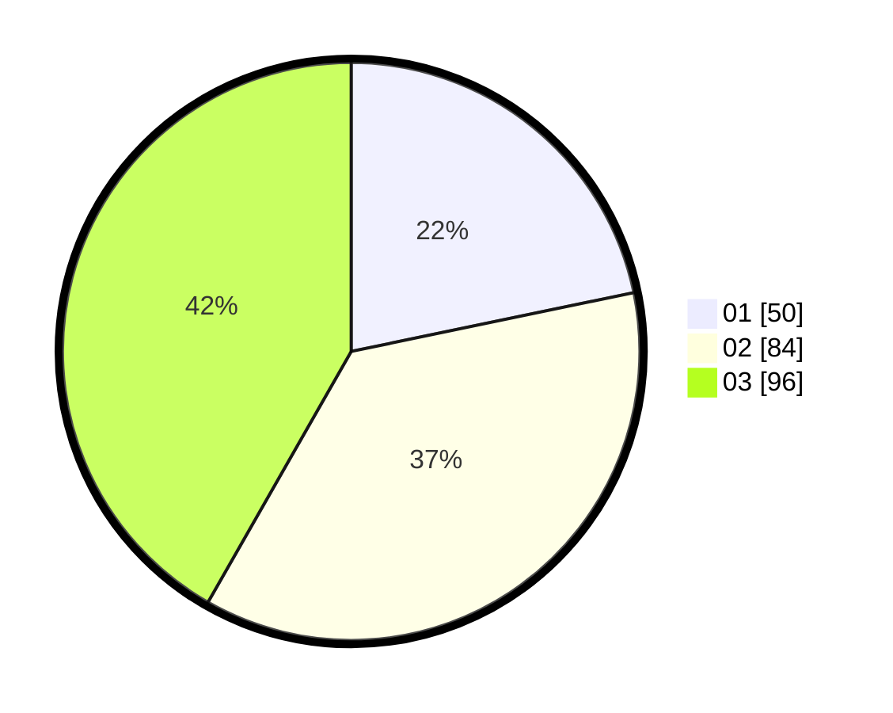

# Hasil

Hasil perolehan suara paslon dapat dilihat pada file paslon-01.txt, paslon-02.txt, dan paslon-03.txt.

Jika tidak ada, artinya data tersebut belum ada pada SIREKAP.

## Perolehan Suara

 * Paslon 01: **50**.
 * Paslon 02: **84**.
 * Paslon 03: **96**.

## Foto C Plano

https://sirekap-obj-formc.kpu.go.id/5a1d/pemilu/ppwp/31/74/02/10/05/3174021005061-20240214-195526--66f754a4-9331-40b9-a5ae-bff697d35f21.jpg

https://sirekap-obj-formc.kpu.go.id/5a1d/pemilu/ppwp/31/74/02/10/05/3174021005061-20240214-195622--df73b37f-622f-4ead-a957-92b94061a940.jpg

https://sirekap-obj-formc.kpu.go.id/5a1d/pemilu/ppwp/31/74/02/10/05/3174021005061-20240214-195751--714e64d2-336d-4300-896f-08c6624bc1d4.jpg

## DATA PEMILIH TETAP

Jumlah pemilih dalam DPT: **288**.
 * L: **116**.
 * P: **172**.

## DATA PENGGUNA HAK PILIH

Jumlah pengguna hak pilih dalam DPT: **202**.
 * L: **79**.
 * P: **123**.

Jumlah pengguna hak pilih dalam DPTb: **26**.
 * L: **10**.
 * P: **16**.

Jumlah pengguna hak pilih dalam DPK: **7**.
 * L: **3**.
 * P: **4**.

Jumlah pengguna hak pilih: **235**.
 * L: **92**.
 * P: **143**.

## JUMLAH SUARA SAH DAN TIDAK SAH

JUMLAH SELURUH SUARA SAH: **230**.

JUMLAH SUARA TIDAK SAH: **5**.

JUMLAH SELURUH SUARA SAH DAN SUARA TIDAK SAH: **235**.
