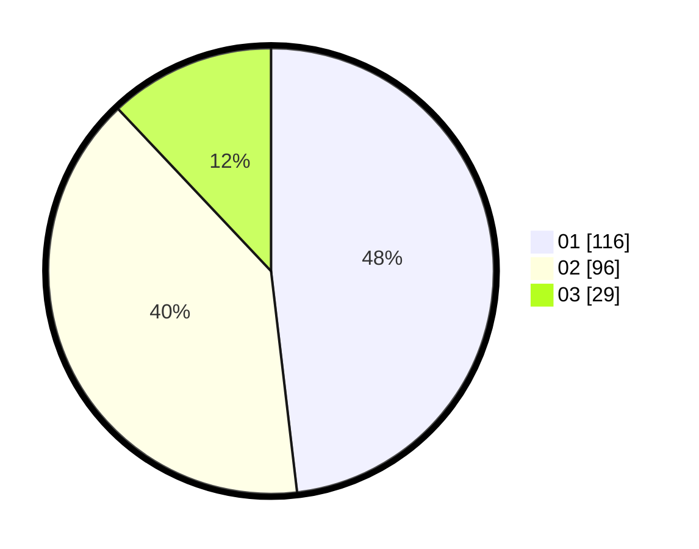

# Hasil

Hasil perolehan suara paslon dapat dilihat pada file paslon-01.txt, paslon-02.txt, dan paslon-03.txt.

Jika tidak ada, artinya data tersebut belum ada pada SIREKAP.

## Perolehan Suara

 * Paslon 01: **116**.
 * Paslon 02: **96**.
 * Paslon 03: **29**.

## Foto C Plano

https://sirekap-obj-formc.kpu.go.id/d1b3/pemilu/ppwp/31/74/02/10/05/3174021005081-20240215-022534--0a0d236e-6c6b-4873-ab4c-a6cbca4d3486.jpg

https://sirekap-obj-formc.kpu.go.id/d1b3/pemilu/ppwp/31/74/02/10/05/3174021005081-20240215-022654--54c3934d-9a17-42d3-a56c-dc39f3742eff.jpg

https://sirekap-obj-formc.kpu.go.id/d1b3/pemilu/ppwp/31/74/02/10/05/3174021005081-20240215-022805--1fe2d416-5ce2-4ecd-8889-c30595f56dbb.jpg

## DATA PEMILIH TETAP

Jumlah pemilih dalam DPT: **280**.
 * L: **140**.
 * P: **140**.

## DATA PENGGUNA HAK PILIH

Jumlah pengguna hak pilih dalam DPT: **226**.
 * L: **107**.
 * P: **119**.

Jumlah pengguna hak pilih dalam DPTb: **0**.
 * L: **0**.
 * P: **0**.

Jumlah pengguna hak pilih dalam DPK: **15**.
 * L: **9**.
 * P: **6**.

Jumlah pengguna hak pilih: **241**.
 * L: **116**.
 * P: **125**.

## JUMLAH SUARA SAH DAN TIDAK SAH

JUMLAH SELURUH SUARA SAH: **241**.

JUMLAH SUARA TIDAK SAH: **0**.

JUMLAH SELURUH SUARA SAH DAN SUARA TIDAK SAH: **241**.
