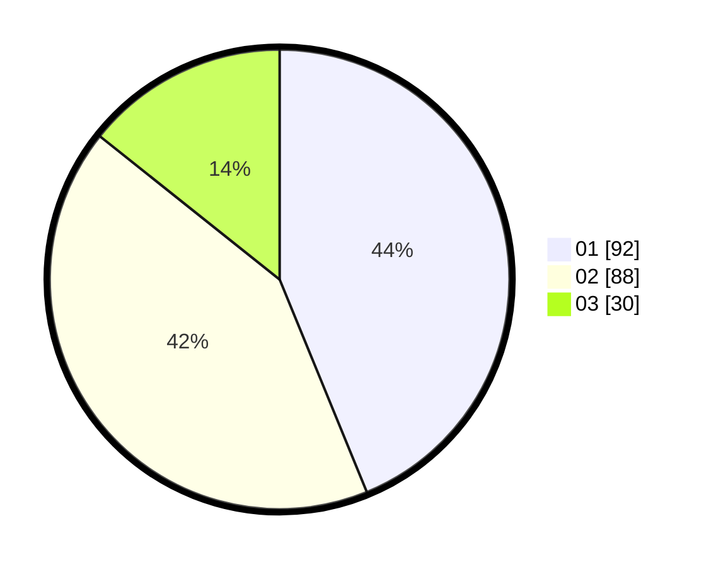

# Hasil

Hasil perolehan suara paslon dapat dilihat pada file paslon-01.txt, paslon-02.txt, dan paslon-03.txt.

Jika tidak ada, artinya data tersebut belum ada pada SIREKAP.

## Perolehan Suara

 * Paslon 01: **92**.
 * Paslon 02: **88**.
 * Paslon 03: **30**.

## Foto C Plano

https://sirekap-obj-formc.kpu.go.id/72cd/pemilu/ppwp/31/74/02/10/05/3174021005095-20240219-043313--da0bcb2e-7e76-4205-9e13-dd5f97dee85c.jpg

https://sirekap-obj-formc.kpu.go.id/72cd/pemilu/ppwp/31/74/02/10/05/3174021005095-20240215-023123--ae49f6cc-a267-4cb6-8f90-2771da368f2b.jpg

https://sirekap-obj-formc.kpu.go.id/72cd/pemilu/ppwp/31/74/02/10/05/3174021005095-20240218-215225--468f7690-cb85-4d97-a14d-41b1a7753eab.jpg
