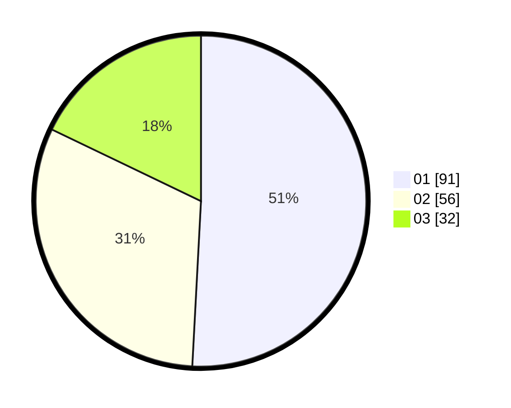

# Hasil

Hasil perolehan suara paslon dapat dilihat pada file paslon-01.txt, paslon-02.txt, dan paslon-03.txt.

Jika tidak ada, artinya data tersebut belum ada pada SIREKAP.

## Perolehan Suara

 * Paslon 01: **91**.
 * Paslon 02: **56**.
 * Paslon 03: **32**.

## Foto C Plano

https://sirekap-obj-formc.kpu.go.id/687e/pemilu/ppwp/31/74/02/10/06/3174021006008-20240214-155227--612d0bfa-3352-43ce-9555-97bb2fce1aee.jpg

https://sirekap-obj-formc.kpu.go.id/687e/pemilu/ppwp/31/74/02/10/06/3174021006008-20240214-155518--b2e4905c-4bfd-4484-a8ba-d07138101775.jpg

https://sirekap-obj-formc.kpu.go.id/687e/pemilu/ppwp/31/74/02/10/06/3174021006008-20240214-155236--7755a00c-15e6-43e2-b9e3-7fdc6fd5eda3.jpg

## DATA PEMILIH TETAP

Jumlah pemilih dalam DPT: **244**.
 * L: **119**.
 * P: **125**.

## DATA PENGGUNA HAK PILIH

Jumlah pengguna hak pilih dalam DPT: **170**.
 * L: **80**.
 * P: **90**.

Jumlah pengguna hak pilih dalam DPTb: **9**.
 * L: **7**.
 * P: **2**.

Jumlah pengguna hak pilih dalam DPK: **2**.
 * L: **2**.
 * P: **0**.

Jumlah pengguna hak pilih: **181**.
 * L: **89**.
 * P: **92**.

## JUMLAH SUARA SAH DAN TIDAK SAH

JUMLAH SELURUH SUARA SAH: **179**.

JUMLAH SUARA TIDAK SAH: **2**.

JUMLAH SELURUH SUARA SAH DAN SUARA TIDAK SAH: **181**.
