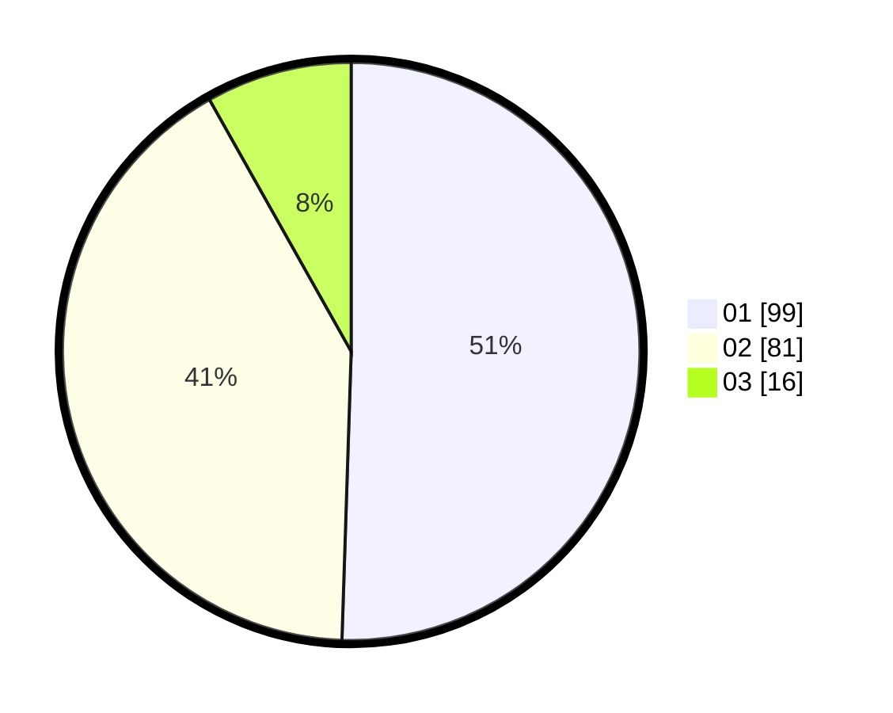

# Hasil

Hasil perolehan suara paslon dapat dilihat pada file paslon-01.txt, paslon-02.txt, dan paslon-03.txt.

Jika tidak ada, artinya data tersebut belum ada pada SIREKAP.

## Perolehan Suara

 * Paslon 01: **99**.
 * Paslon 02: **81**.
 * Paslon 03: **16**.

## Foto C Plano

https://sirekap-obj-formc.kpu.go.id/4b1e/pemilu/ppwp/31/74/02/10/06/3174021006031-20240214-223252--d3ffd77e-04bf-48df-a257-84be8d5fa194.jpg

https://sirekap-obj-formc.kpu.go.id/4b1e/pemilu/ppwp/31/74/02/10/06/3174021006031-20240214-223447--c8c849f1-fea6-48f6-9842-51a9bc222c34.jpg

https://sirekap-obj-formc.kpu.go.id/4b1e/pemilu/ppwp/31/74/02/10/06/3174021006031-20240214-223648--a8b3b544-4839-429e-bd70-65f38d21e2f0.jpg

## DATA PEMILIH TETAP

Jumlah pemilih dalam DPT: **273**.
 * L: **137**.
 * P: **136**.

## DATA PENGGUNA HAK PILIH

Jumlah pengguna hak pilih dalam DPT: **199**.
 * L: **99**.
 * P: **100**.

Jumlah pengguna hak pilih dalam DPTb: **1**.
 * L: **0**.
 * P: **1**.

Jumlah pengguna hak pilih dalam DPK: **0**.
 * L: **0**.
 * P: **0**.

Jumlah pengguna hak pilih: **200**.
 * L: **99**.
 * P: **101**.

## JUMLAH SUARA SAH DAN TIDAK SAH

JUMLAH SELURUH SUARA SAH: **196**.

JUMLAH SUARA TIDAK SAH: **4**.

JUMLAH SELURUH SUARA SAH DAN SUARA TIDAK SAH: **200**.
