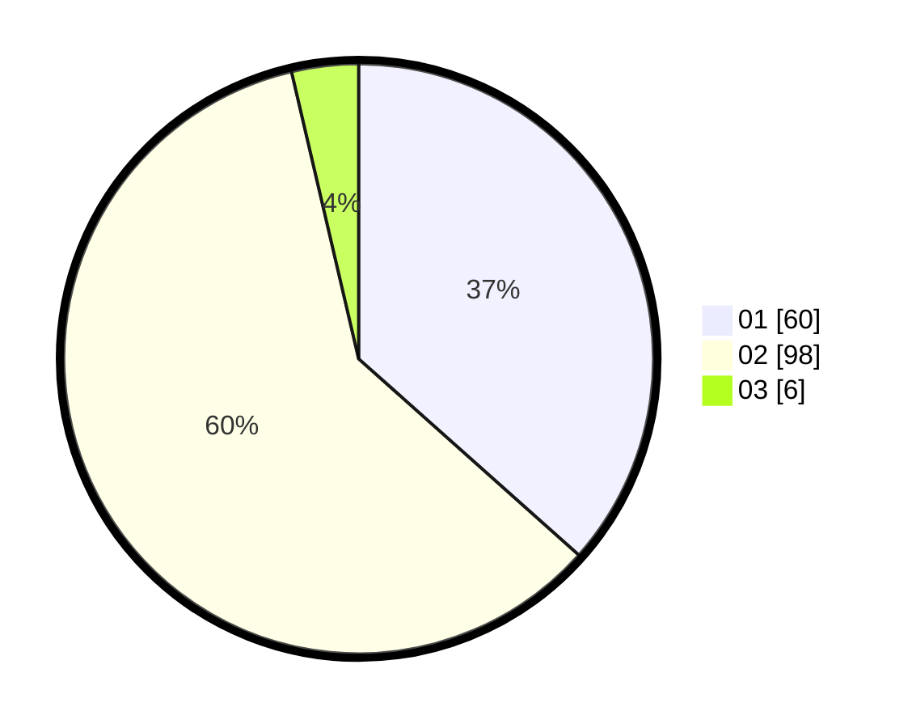

# Hasil

Hasil perolehan suara paslon dapat dilihat pada file paslon-01.txt, paslon-02.txt, dan paslon-03.txt.

Jika tidak ada, artinya data tersebut belum ada pada SIREKAP.

## Perolehan Suara

 * Paslon 01: **60**.
 * Paslon 02: **98**.
 * Paslon 03: **6**.

## Foto C Plano

https://sirekap-obj-formc.kpu.go.id/7adb/pemilu/ppwp/31/74/02/10/06/3174021006033-20240214-235250--2b04c7d4-5d2c-4877-9e1c-232f11917bf6.jpg

https://sirekap-obj-formc.kpu.go.id/7adb/pemilu/ppwp/31/74/02/10/06/3174021006033-20240214-235318--231461d4-bf8b-4f64-a045-2a691d376854.jpg

https://sirekap-obj-formc.kpu.go.id/7adb/pemilu/ppwp/31/74/02/10/06/3174021006033-20240214-235314--60b29a8b-b2b7-4475-8c11-ba1494182f0c.jpg

## DATA PEMILIH TETAP

Jumlah pemilih dalam DPT: **223**.
 * L: **98**.
 * P: **125**.

## DATA PENGGUNA HAK PILIH

Jumlah pengguna hak pilih dalam DPT: **157**.
 * L: **59**.
 * P: **98**.

Jumlah pengguna hak pilih dalam DPTb: **0**.
 * L: **0**.
 * P: **0**.

Jumlah pengguna hak pilih dalam DPK: **7**.
 * L: **4**.
 * P: **3**.

Jumlah pengguna hak pilih: **164**.
 * L: **63**.
 * P: **101**.

## JUMLAH SUARA SAH DAN TIDAK SAH

JUMLAH SELURUH SUARA SAH: **164**.

JUMLAH SUARA TIDAK SAH: **0**.

JUMLAH SELURUH SUARA SAH DAN SUARA TIDAK SAH: **164**.
