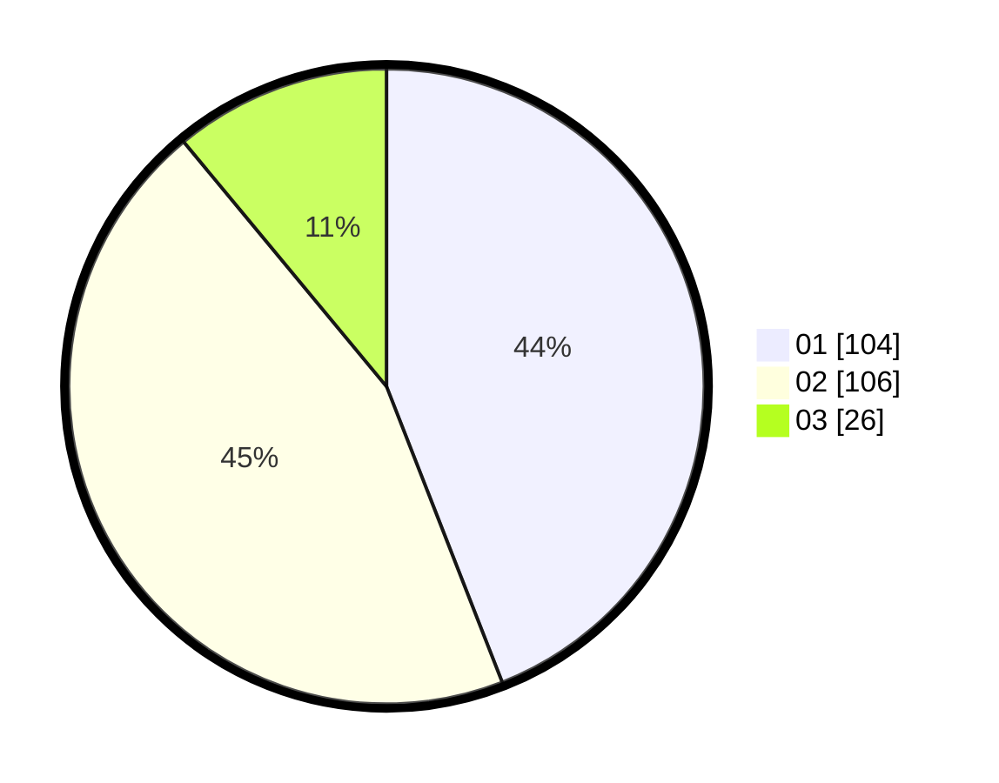

# Hasil

Hasil perolehan suara paslon dapat dilihat pada file paslon-01.txt, paslon-02.txt, dan paslon-03.txt.

Jika tidak ada, artinya data tersebut belum ada pada SIREKAP.

## Perolehan Suara

 * Paslon 01: **104**.
 * Paslon 02: **106**.
 * Paslon 03: **26**.

## Foto C Plano

https://sirekap-obj-formc.kpu.go.id/29d0/pemilu/ppwp/31/74/02/10/06/3174021006057-20240214-195841--714dc7df-897a-4a56-affc-cccfc1f22aea.jpg

https://sirekap-obj-formc.kpu.go.id/29d0/pemilu/ppwp/31/74/02/10/06/3174021006057-20240214-200013--223f1078-3bd5-4bfd-ba6f-726d371b123c.jpg

https://sirekap-obj-formc.kpu.go.id/29d0/pemilu/ppwp/31/74/02/10/06/3174021006057-20240214-200132--5a4dec26-37fd-498b-9bde-0386400a957e.jpg

## DATA PEMILIH TETAP

Jumlah pemilih dalam DPT: **280**.
 * L: **140**.
 * P: **140**.

## DATA PENGGUNA HAK PILIH

Jumlah pengguna hak pilih dalam DPT: **237**.
 * L: **114**.
 * P: **123**.

Jumlah pengguna hak pilih dalam DPTb: **2**.
 * L: **0**.
 * P: **2**.

Jumlah pengguna hak pilih dalam DPK: **0**.
 * L: **0**.
 * P: **0**.

Jumlah pengguna hak pilih: **239**.
 * L: **114**.
 * P: **125**.

## JUMLAH SUARA SAH DAN TIDAK SAH

JUMLAH SELURUH SUARA SAH: **236**.

JUMLAH SUARA TIDAK SAH: **3**.

JUMLAH SELURUH SUARA SAH DAN SUARA TIDAK SAH: **239**.
