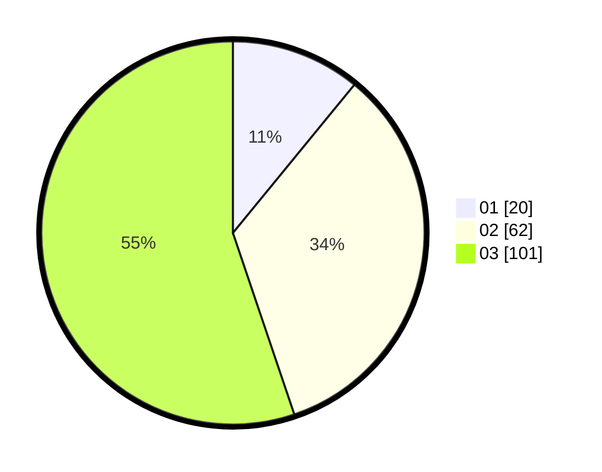

# Hasil

Hasil perolehan suara paslon dapat dilihat pada file paslon-01.txt, paslon-02.txt, dan paslon-03.txt.

Jika tidak ada, artinya data tersebut belum ada pada SIREKAP.

## Perolehan Suara

 * Paslon 01: **20**.
 * Paslon 02: **62**.
 * Paslon 03: **101**.

## Foto C Plano

https://sirekap-obj-formc.kpu.go.id/1990/pemilu/ppwp/31/74/02/10/07/3174021007001-20240214-155058--209a3f9c-312e-474c-9d69-e21fdad41dc5.jpg

https://sirekap-obj-formc.kpu.go.id/1990/pemilu/ppwp/31/74/02/10/07/3174021007001-20240214-155103--a11d7caf-02ac-40f5-ae4f-174a6f4193f6.jpg

https://sirekap-obj-formc.kpu.go.id/1990/pemilu/ppwp/31/74/02/10/07/3174021007001-20240214-155051--95328447-7d18-4ac3-9999-eb66b9b3df09.jpg

## DATA PEMILIH TETAP

Jumlah pemilih dalam DPT: **237**.
 * L: **108**.
 * P: **129**.

## DATA PENGGUNA HAK PILIH

Jumlah pengguna hak pilih dalam DPT: **171**.
 * L: **79**.
 * P: **92**.

Jumlah pengguna hak pilih dalam DPTb: **11**.
 * L: **6**.
 * P: **5**.

Jumlah pengguna hak pilih dalam DPK: **3**.
 * L: **0**.
 * P: **3**.

Jumlah pengguna hak pilih: **185**.
 * L: **85**.
 * P: **100**.

## JUMLAH SUARA SAH DAN TIDAK SAH

JUMLAH SELURUH SUARA SAH: **183**.

JUMLAH SUARA TIDAK SAH: **2**.

JUMLAH SELURUH SUARA SAH DAN SUARA TIDAK SAH: **185**.
