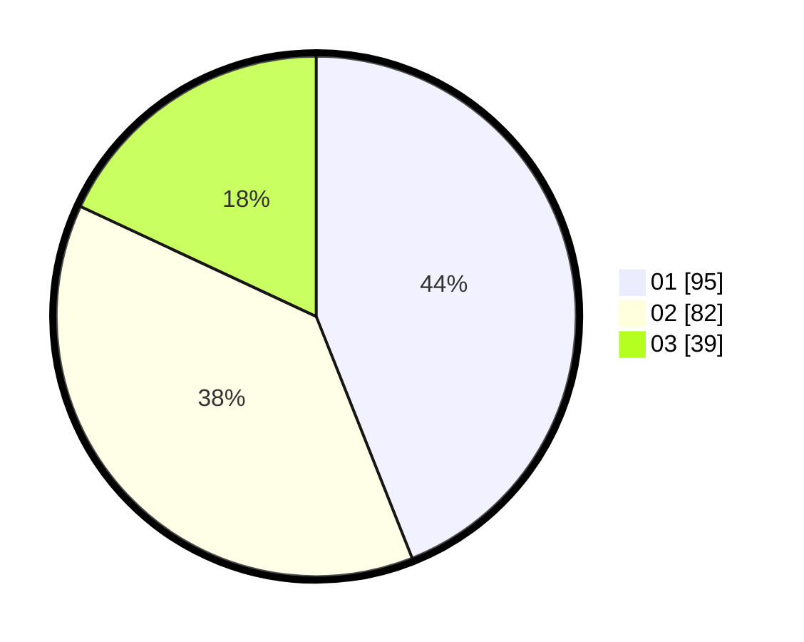

# Hasil

Hasil perolehan suara paslon dapat dilihat pada file paslon-01.txt, paslon-02.txt, dan paslon-03.txt.

Jika tidak ada, artinya data tersebut belum ada pada SIREKAP.

## Perolehan Suara

 * Paslon 01: **95**.
 * Paslon 02: **82**.
 * Paslon 03: **39**.

## Foto C Plano

https://sirekap-obj-formc.kpu.go.id/d4d9/pemilu/ppwp/31/74/02/10/07/3174021007012-20240215-231924--2a02661e-7f98-4409-97cb-2fa514a5dbd2.jpg

https://sirekap-obj-formc.kpu.go.id/d4d9/pemilu/ppwp/31/74/02/10/07/3174021007012-20240215-231930--cbed1995-80a4-4e22-b308-7e54426e280f.jpg

https://sirekap-obj-formc.kpu.go.id/d4d9/pemilu/ppwp/31/74/02/10/07/3174021007012-20240215-231927--e81b3e32-4919-4ca9-b036-f53a227d0673.jpg

## DATA PEMILIH TETAP

Jumlah pemilih dalam DPT: **267**.
 * L: **124**.
 * P: **143**.

## DATA PENGGUNA HAK PILIH

Jumlah pengguna hak pilih dalam DPT: **218**.
 * L: **99**.
 * P: **119**.

Jumlah pengguna hak pilih dalam DPTb: **4**.
 * L: **3**.
 * P: **1**.

Jumlah pengguna hak pilih dalam DPK: **1**.
 * L: **0**.
 * P: **1**.

Jumlah pengguna hak pilih: **223**.
 * L: **102**.
 * P: **121**.

## JUMLAH SUARA SAH DAN TIDAK SAH

JUMLAH SELURUH SUARA SAH: **216**.

JUMLAH SUARA TIDAK SAH: **7**.

JUMLAH SELURUH SUARA SAH DAN SUARA TIDAK SAH: **223**.
