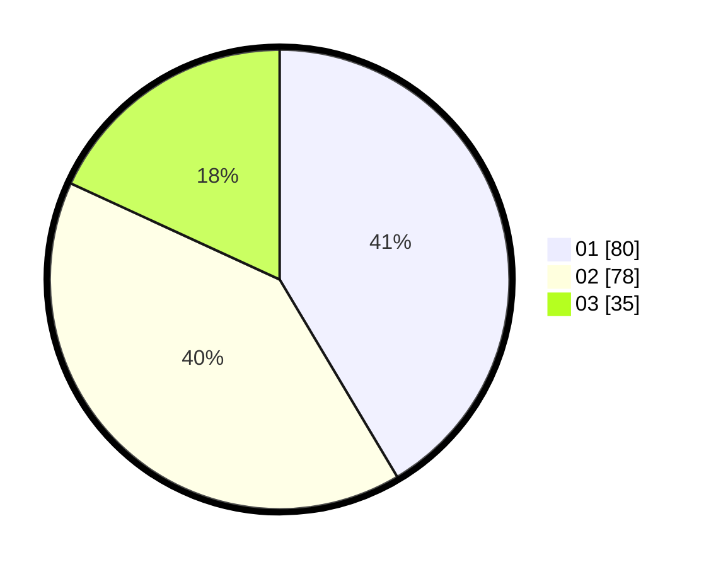

# Hasil

Hasil perolehan suara paslon dapat dilihat pada file paslon-01.txt, paslon-02.txt, dan paslon-03.txt.

Jika tidak ada, artinya data tersebut belum ada pada SIREKAP.

## Perolehan Suara

 * Paslon 01: **80**.
 * Paslon 02: **78**.
 * Paslon 03: **35**.

## Foto C Plano

https://sirekap-obj-formc.kpu.go.id/6364/pemilu/ppwp/31/74/02/10/07/3174021007013-20240214-201534--8e913471-3695-4381-8d1b-2ed1b71a0d04.jpg

https://sirekap-obj-formc.kpu.go.id/6364/pemilu/ppwp/31/74/02/10/07/3174021007013-20240214-202937--29ddf2c4-9d36-4491-bfc8-9418b686641b.jpg

https://sirekap-obj-formc.kpu.go.id/6364/pemilu/ppwp/31/74/02/10/07/3174021007013-20240214-203039--0db61f5d-4410-4b77-b769-21e274d80e33.jpg

## DATA PEMILIH TETAP

Jumlah pemilih dalam DPT: **261**.
 * L: **133**.
 * P: **128**.

## DATA PENGGUNA HAK PILIH

Jumlah pengguna hak pilih dalam DPT: **188**.
 * L: **93**.
 * P: **95**.

Jumlah pengguna hak pilih dalam DPTb: **11**.
 * L: **7**.
 * P: **4**.

Jumlah pengguna hak pilih dalam DPK: **0**.
 * L: **0**.
 * P: **0**.

Jumlah pengguna hak pilih: **199**.
 * L: **100**.
 * P: **99**.

## JUMLAH SUARA SAH DAN TIDAK SAH

JUMLAH SELURUH SUARA SAH: **193**.

JUMLAH SUARA TIDAK SAH: **6**.

JUMLAH SELURUH SUARA SAH DAN SUARA TIDAK SAH: **199**.
