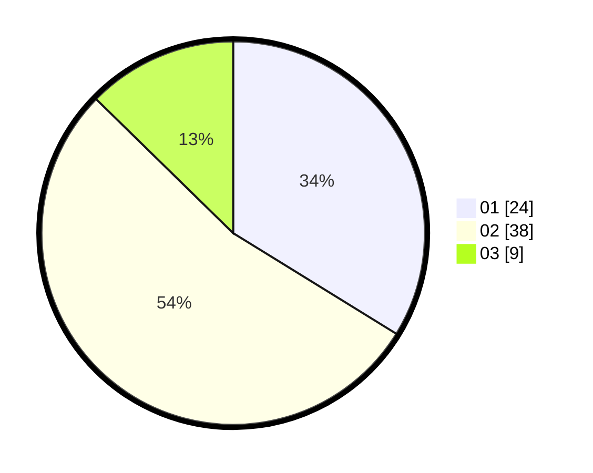

# Hasil

Hasil perolehan suara paslon dapat dilihat pada file paslon-01.txt, paslon-02.txt, dan paslon-03.txt.

Jika tidak ada, artinya data tersebut belum ada pada SIREKAP.

## Perolehan Suara

 * Paslon 01: **24**.
 * Paslon 02: **38**.
 * Paslon 03: **9**.

## Foto C Plano

https://sirekap-obj-formc.kpu.go.id/1aa0/pemilu/ppwp/31/74/02/10/07/3174021007901-20240214-155056--31b32c48-9b1e-4582-ad94-40db1e7103b9.jpg

https://sirekap-obj-formc.kpu.go.id/1aa0/pemilu/ppwp/31/74/02/10/07/3174021007901-20240214-184929--cd542f1f-cdb9-42ce-8aa8-ff3f45e856aa.jpg

https://sirekap-obj-formc.kpu.go.id/1aa0/pemilu/ppwp/31/74/02/10/07/3174021007901-20240214-155044--fdefea73-0290-4a98-ba39-7c5b7963c4ec.jpg

## DATA PEMILIH TETAP

Jumlah pemilih dalam DPT: **88**.
 * L: **83**.
 * P: **5**.

## DATA PENGGUNA HAK PILIH

Jumlah pengguna hak pilih dalam DPT: **23**.
 * L: **21**.
 * P: **2**.

Jumlah pengguna hak pilih dalam DPTb: **53**.
 * L: **50**.
 * P: **3**.

Jumlah pengguna hak pilih dalam DPK: **0**.
 * L: **0**.
 * P: **0**.

Jumlah pengguna hak pilih: **76**.
 * L: **71**.
 * P: **5**.

## JUMLAH SUARA SAH DAN TIDAK SAH

JUMLAH SELURUH SUARA SAH: **71**.

JUMLAH SUARA TIDAK SAH: **5**.

JUMLAH SELURUH SUARA SAH DAN SUARA TIDAK SAH: **76**.
