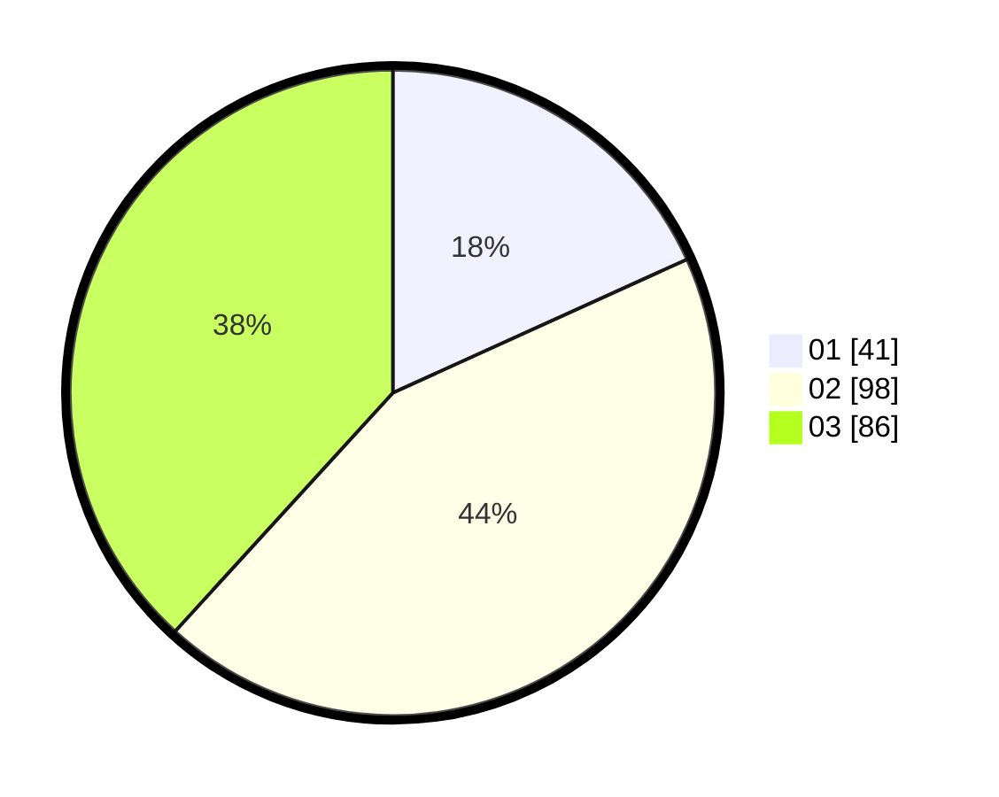

# Hasil

Hasil perolehan suara paslon dapat dilihat pada file paslon-01.txt, paslon-02.txt, dan paslon-03.txt.

Jika tidak ada, artinya data tersebut belum ada pada SIREKAP.

## Perolehan Suara

 * Paslon 01: **41**.
 * Paslon 02: **98**.
 * Paslon 03: **86**.

## Foto C Plano

https://sirekap-obj-formc.kpu.go.id/4606/pemilu/ppwp/31/74/02/10/08/3174021008001-20240214-205625--429c4606-3c2c-47c1-8815-974b1004e770.jpg

https://sirekap-obj-formc.kpu.go.id/4606/pemilu/ppwp/31/74/02/10/08/3174021008001-20240214-201445--cd7779cd-2884-483c-82a3-97a44f885c86.jpg

https://sirekap-obj-formc.kpu.go.id/4606/pemilu/ppwp/31/74/02/10/08/3174021008001-20240214-202627--d8235887-3058-43fc-9b88-75202e82c63b.jpg

## DATA PEMILIH TETAP

Jumlah pemilih dalam DPT: **187**.
 * L: **87**.
 * P: **100**.

## DATA PENGGUNA HAK PILIH

Jumlah pengguna hak pilih dalam DPT: **187**.
 * L: **87**.
 * P: **100**.

Jumlah pengguna hak pilih dalam DPTb: **22**.
 * L: **9**.
 * P: **13**.

Jumlah pengguna hak pilih dalam DPK: **18**.
 * L: **8**.
 * P: **10**.

Jumlah pengguna hak pilih: **227**.
 * L: **105**.
 * P: **122**.

## JUMLAH SUARA SAH DAN TIDAK SAH

JUMLAH SELURUH SUARA SAH: **225**.

JUMLAH SUARA TIDAK SAH: **2**.

JUMLAH SELURUH SUARA SAH DAN SUARA TIDAK SAH: **227**.
