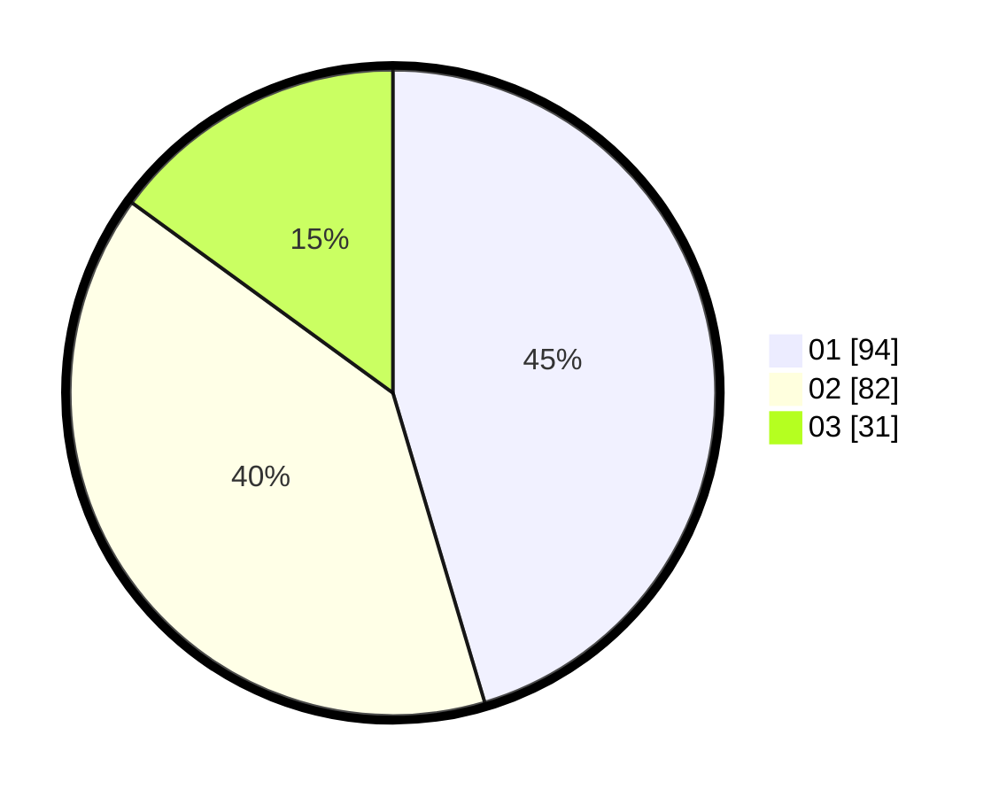

# Hasil

Hasil perolehan suara paslon dapat dilihat pada file paslon-01.txt, paslon-02.txt, dan paslon-03.txt.

Jika tidak ada, artinya data tersebut belum ada pada SIREKAP.

## Perolehan Suara

 * Paslon 01: **94**.
 * Paslon 02: **82**.
 * Paslon 03: **31**.

## Foto C Plano

https://sirekap-obj-formc.kpu.go.id/bf56/pemilu/ppwp/31/74/02/10/08/3174021008004-20240214-230017--5c901ba1-c054-4535-86eb-0a18cacfd671.jpg

https://sirekap-obj-formc.kpu.go.id/bf56/pemilu/ppwp/31/74/02/10/08/3174021008004-20240214-203156--ae91bca0-ac29-467e-8284-4de06d64a0b3.jpg

https://sirekap-obj-formc.kpu.go.id/bf56/pemilu/ppwp/31/74/02/10/08/3174021008004-20240214-212856--34bc3435-c84e-49c5-a602-42d85ea18309.jpg
