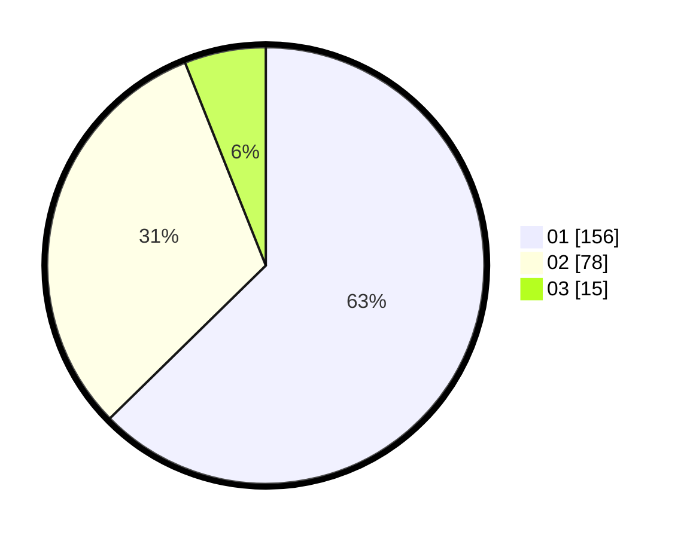

# Hasil

Hasil perolehan suara paslon dapat dilihat pada file paslon-01.txt, paslon-02.txt, dan paslon-03.txt.

Jika tidak ada, artinya data tersebut belum ada pada SIREKAP.

## Perolehan Suara

 * Paslon 01: **156**.
 * Paslon 02: **78**.
 * Paslon 03: **15**.

## Foto C Plano

https://sirekap-obj-formc.kpu.go.id/3792/pemilu/ppwp/31/74/02/10/08/3174021008014-20240214-184723--f3e3a1f3-0e32-4759-95bf-91578bf0ff44.jpg

https://sirekap-obj-formc.kpu.go.id/3792/pemilu/ppwp/31/74/02/10/08/3174021008014-20240214-185345--d8df2d0f-b817-4e5c-8221-5966f6ac898b.jpg

https://sirekap-obj-formc.kpu.go.id/3792/pemilu/ppwp/31/74/02/10/08/3174021008014-20240214-185623--ce0dd7b7-c4ce-4398-a7c9-436dd28f4fda.jpg

## DATA PEMILIH TETAP

Jumlah pemilih dalam DPT: **281**.
 * L: **137**.
 * P: **144**.

## DATA PENGGUNA HAK PILIH

Jumlah pengguna hak pilih dalam DPT: **226**.
 * L: **109**.
 * P: **117**.

Jumlah pengguna hak pilih dalam DPTb: **20**.
 * L: **4**.
 * P: **16**.

Jumlah pengguna hak pilih dalam DPK: **5**.
 * L: **2**.
 * P: **3**.

Jumlah pengguna hak pilih: **251**.
 * L: **115**.
 * P: **136**.

## JUMLAH SUARA SAH DAN TIDAK SAH

JUMLAH SELURUH SUARA SAH: **249**.

JUMLAH SUARA TIDAK SAH: **2**.

JUMLAH SELURUH SUARA SAH DAN SUARA TIDAK SAH: **251**.
