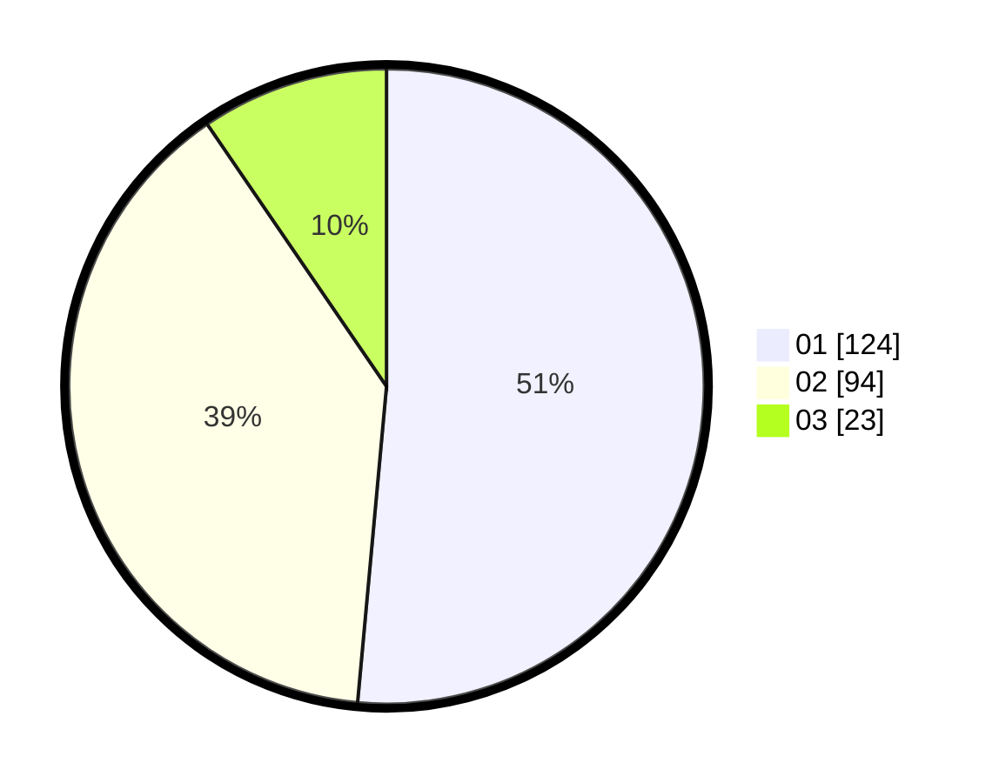

# Hasil

Hasil perolehan suara paslon dapat dilihat pada file paslon-01.txt, paslon-02.txt, dan paslon-03.txt.

Jika tidak ada, artinya data tersebut belum ada pada SIREKAP.

## Perolehan Suara

 * Paslon 01: **124**.
 * Paslon 02: **94**.
 * Paslon 03: **23**.

## Foto C Plano

https://sirekap-obj-formc.kpu.go.id/9c3c/pemilu/ppwp/31/74/02/10/08/3174021008016-20240214-234048--d2f4b403-999c-4bb6-9df8-051dd270f18d.jpg

https://sirekap-obj-formc.kpu.go.id/9c3c/pemilu/ppwp/31/74/02/10/08/3174021008016-20240214-234350--7444b8db-84a8-4ce1-93d5-5a1e94b4841a.jpg

https://sirekap-obj-formc.kpu.go.id/9c3c/pemilu/ppwp/31/74/02/10/08/3174021008016-20240214-234511--672d305f-5f9a-4e45-b338-13adcfa24ab6.jpg

## DATA PEMILIH TETAP

Jumlah pemilih dalam DPT: **271**.
 * L: **136**.
 * P: **135**.

## DATA PENGGUNA HAK PILIH

Jumlah pengguna hak pilih dalam DPT: **230**.
 * L: **117**.
 * P: **113**.

Jumlah pengguna hak pilih dalam DPTb: **13**.
 * L: **2**.
 * P: **11**.

Jumlah pengguna hak pilih dalam DPK: **3**.
 * L: **0**.
 * P: **3**.

Jumlah pengguna hak pilih: **246**.
 * L: **119**.
 * P: **127**.

## JUMLAH SUARA SAH DAN TIDAK SAH

JUMLAH SELURUH SUARA SAH: **241**.

JUMLAH SUARA TIDAK SAH: **5**.

JUMLAH SELURUH SUARA SAH DAN SUARA TIDAK SAH: **246**.
