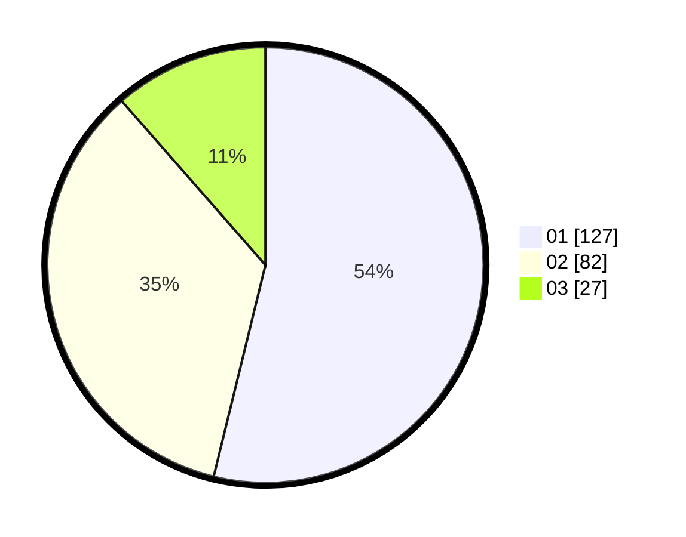

# Hasil

Hasil perolehan suara paslon dapat dilihat pada file paslon-01.txt, paslon-02.txt, dan paslon-03.txt.

Jika tidak ada, artinya data tersebut belum ada pada SIREKAP.

## Perolehan Suara

 * Paslon 01: **127**.
 * Paslon 02: **82**.
 * Paslon 03: **27**.

## Foto C Plano

https://sirekap-obj-formc.kpu.go.id/786a/pemilu/ppwp/31/74/02/10/08/3174021008019-20240214-193135--7f47d674-7dd6-4171-b40f-7e0d6e8c78a2.jpg

https://sirekap-obj-formc.kpu.go.id/786a/pemilu/ppwp/31/74/02/10/08/3174021008019-20240214-193156--3c2b03ee-c56b-45ce-9146-8c22e1943e5c.jpg

https://sirekap-obj-formc.kpu.go.id/786a/pemilu/ppwp/31/74/02/10/08/3174021008019-20240214-193222--bc9831f9-89c6-4378-80da-5e8108aaab68.jpg

## DATA PEMILIH TETAP

Jumlah pemilih dalam DPT: **296**.
 * L: **152**.
 * P: **144**.

## DATA PENGGUNA HAK PILIH

Jumlah pengguna hak pilih dalam DPT: **212**.
 * L: **107**.
 * P: **105**.

Jumlah pengguna hak pilih dalam DPTb: **20**.
 * L: **8**.
 * P: **12**.

Jumlah pengguna hak pilih dalam DPK: **4**.
 * L: **3**.
 * P: **1**.

Jumlah pengguna hak pilih: **236**.
 * L: **118**.
 * P: **118**.

## JUMLAH SUARA SAH DAN TIDAK SAH

JUMLAH SELURUH SUARA SAH: **236**.

JUMLAH SUARA TIDAK SAH: **0**.

JUMLAH SELURUH SUARA SAH DAN SUARA TIDAK SAH: **236**.
