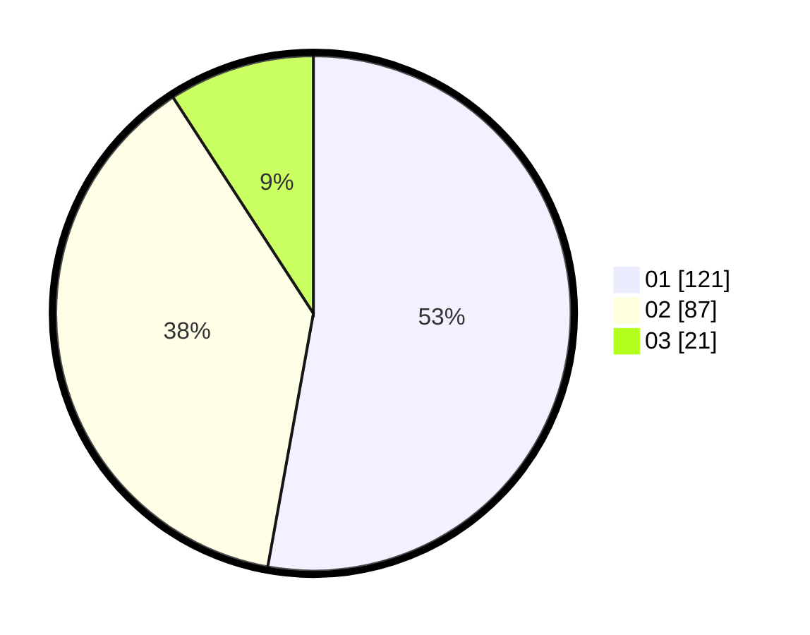

# Hasil

Hasil perolehan suara paslon dapat dilihat pada file paslon-01.txt, paslon-02.txt, dan paslon-03.txt.

Jika tidak ada, artinya data tersebut belum ada pada SIREKAP.

## Perolehan Suara

 * Paslon 01: **121**.
 * Paslon 02: **87**.
 * Paslon 03: **21**.

## Foto C Plano

https://sirekap-obj-formc.kpu.go.id/7eb0/pemilu/ppwp/31/74/02/10/08/3174021008021-20240216-122412--9d0b4f47-e388-430d-90f1-91fac5c9139a.jpg

https://sirekap-obj-formc.kpu.go.id/7eb0/pemilu/ppwp/31/74/02/10/08/3174021008021-20240216-122413--cc2f3a82-b397-479f-a5a3-7049fa823e66.jpg

https://sirekap-obj-formc.kpu.go.id/7eb0/pemilu/ppwp/31/74/02/10/08/3174021008021-20240216-122412--d458b335-1fb1-4c5c-b6ad-85443ef54d50.jpg

## DATA PEMILIH TETAP

Jumlah pemilih dalam DPT: **275**.
 * L: **143**.
 * P: **132**.

## DATA PENGGUNA HAK PILIH

Jumlah pengguna hak pilih dalam DPT: **215**.
 * L: **105**.
 * P: **110**.

Jumlah pengguna hak pilih dalam DPTb: **15**.
 * L: **6**.
 * P: **9**.

Jumlah pengguna hak pilih dalam DPK: **3**.
 * L: **2**.
 * P: **1**.

Jumlah pengguna hak pilih: **233**.
 * L: **113**.
 * P: **120**.

## JUMLAH SUARA SAH DAN TIDAK SAH

JUMLAH SELURUH SUARA SAH: **229**.

JUMLAH SUARA TIDAK SAH: **4**.

JUMLAH SELURUH SUARA SAH DAN SUARA TIDAK SAH: **233**.
