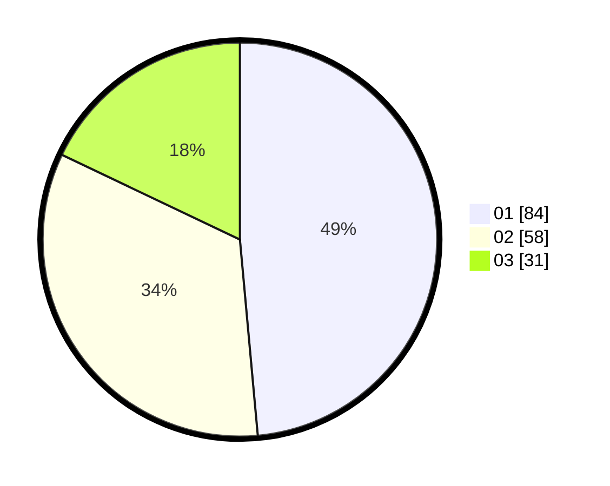

# Hasil

Hasil perolehan suara paslon dapat dilihat pada file paslon-01.txt, paslon-02.txt, dan paslon-03.txt.

Jika tidak ada, artinya data tersebut belum ada pada SIREKAP.

## Perolehan Suara

 * Paslon 01: **84**.
 * Paslon 02: **58**.
 * Paslon 03: **31**.

## Foto C Plano

https://sirekap-obj-formc.kpu.go.id/9565/pemilu/ppwp/31/74/03/10/01/3174031001001-20240215-212108--fe79bf9b-33a4-4eca-9b2c-e36225344013.jpg

https://sirekap-obj-formc.kpu.go.id/9565/pemilu/ppwp/31/74/03/10/01/3174031001001-20240215-212110--d07b1ead-37a4-46a8-96a7-8c073221d125.jpg

https://sirekap-obj-formc.kpu.go.id/9565/pemilu/ppwp/31/74/03/10/01/3174031001001-20240215-212109--da1a6f53-016a-4f14-93a0-2f03991a93cf.jpg

## DATA PEMILIH TETAP

Jumlah pemilih dalam DPT: **208**.
 * L: **105**.
 * P: **103**.

## DATA PENGGUNA HAK PILIH

Jumlah pengguna hak pilih dalam DPT: **168**.
 * L: **85**.
 * P: **83**.

Jumlah pengguna hak pilih dalam DPTb: **6**.
 * L: **4**.
 * P: **2**.

Jumlah pengguna hak pilih dalam DPK: **0**.
 * L: **0**.
 * P: **0**.

Jumlah pengguna hak pilih: **174**.
 * L: **89**.
 * P: **85**.

## JUMLAH SUARA SAH DAN TIDAK SAH

JUMLAH SELURUH SUARA SAH: **173**.

JUMLAH SUARA TIDAK SAH: **1**.

JUMLAH SELURUH SUARA SAH DAN SUARA TIDAK SAH: **174**.
