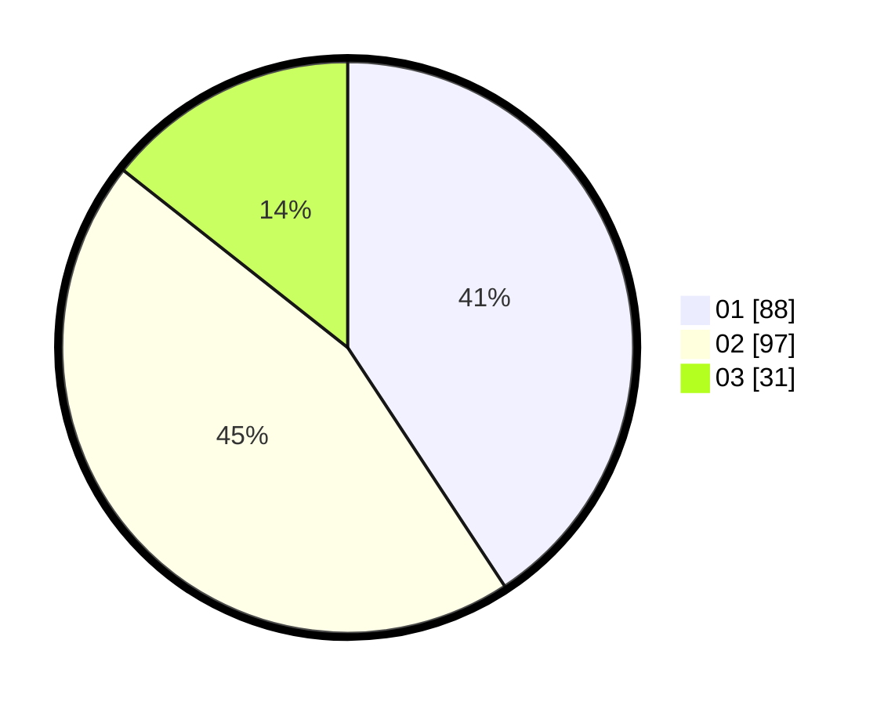

# Hasil

Hasil perolehan suara paslon dapat dilihat pada file paslon-01.txt, paslon-02.txt, dan paslon-03.txt.

Jika tidak ada, artinya data tersebut belum ada pada SIREKAP.

## Perolehan Suara

 * Paslon 01: **88**.
 * Paslon 02: **97**.
 * Paslon 03: **31**.

## Foto C Plano

https://sirekap-obj-formc.kpu.go.id/15c1/pemilu/ppwp/31/74/03/10/01/3174031001007-20240215-233425--2c6de631-3e4d-4c2d-9563-1c926f1049cc.jpg

https://sirekap-obj-formc.kpu.go.id/15c1/pemilu/ppwp/31/74/03/10/01/3174031001007-20240215-233427--66fab47a-8612-43ec-8aea-f32111058f89.jpg

https://sirekap-obj-formc.kpu.go.id/15c1/pemilu/ppwp/31/74/03/10/01/3174031001007-20240215-233427--cd97a32e-e26a-4fca-ac80-d5de5c89ae40.jpg

## DATA PEMILIH TETAP

Jumlah pemilih dalam DPT: **261**.
 * L: **125**.
 * P: **136**.

## DATA PENGGUNA HAK PILIH

Jumlah pengguna hak pilih dalam DPT: **208**.
 * L: **93**.
 * P: **115**.

Jumlah pengguna hak pilih dalam DPTb: **11**.
 * L: **6**.
 * P: **5**.

Jumlah pengguna hak pilih dalam DPK: **0**.
 * L: **0**.
 * P: **0**.

Jumlah pengguna hak pilih: **219**.
 * L: **99**.
 * P: **120**.

## JUMLAH SUARA SAH DAN TIDAK SAH

JUMLAH SELURUH SUARA SAH: **216**.

JUMLAH SUARA TIDAK SAH: **3**.

JUMLAH SELURUH SUARA SAH DAN SUARA TIDAK SAH: **219**.
