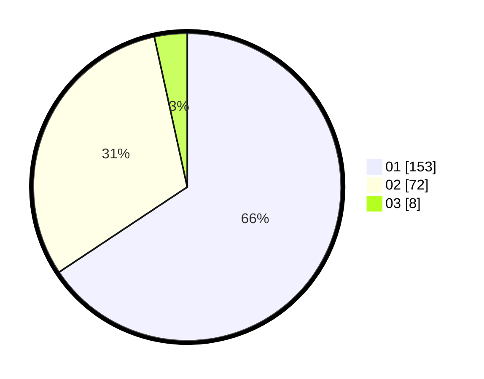

# Hasil

Hasil perolehan suara paslon dapat dilihat pada file paslon-01.txt, paslon-02.txt, dan paslon-03.txt.

Jika tidak ada, artinya data tersebut belum ada pada SIREKAP.

## Perolehan Suara

 * Paslon 01: **153**.
 * Paslon 02: **72**.
 * Paslon 03: **8**.

## Foto C Plano

https://sirekap-obj-formc.kpu.go.id/7644/pemilu/ppwp/31/74/03/10/01/3174031001030-20240214-155035--01277420-9db2-426f-880a-4d14874fbb88.jpg

https://sirekap-obj-formc.kpu.go.id/7644/pemilu/ppwp/31/74/03/10/01/3174031001030-20240214-155040--9464eff7-a120-4a45-913c-0ff7f1cae87b.jpg

https://sirekap-obj-formc.kpu.go.id/7644/pemilu/ppwp/31/74/03/10/01/3174031001030-20240214-155044--d8487118-c283-4683-a61e-c0f967d632ab.jpg

## DATA PEMILIH TETAP

Jumlah pemilih dalam DPT: **249**.
 * L: **119**.
 * P: **130**.

## DATA PENGGUNA HAK PILIH

Jumlah pengguna hak pilih dalam DPT: **227**.
 * L: **108**.
 * P: **119**.

Jumlah pengguna hak pilih dalam DPTb: **7**.
 * L: **1**.
 * P: **6**.

Jumlah pengguna hak pilih dalam DPK: **0**.
 * L: **0**.
 * P: **0**.

Jumlah pengguna hak pilih: **234**.
 * L: **109**.
 * P: **125**.

## JUMLAH SUARA SAH DAN TIDAK SAH

JUMLAH SELURUH SUARA SAH: **233**.

JUMLAH SUARA TIDAK SAH: **1**.

JUMLAH SELURUH SUARA SAH DAN SUARA TIDAK SAH: **234**.
