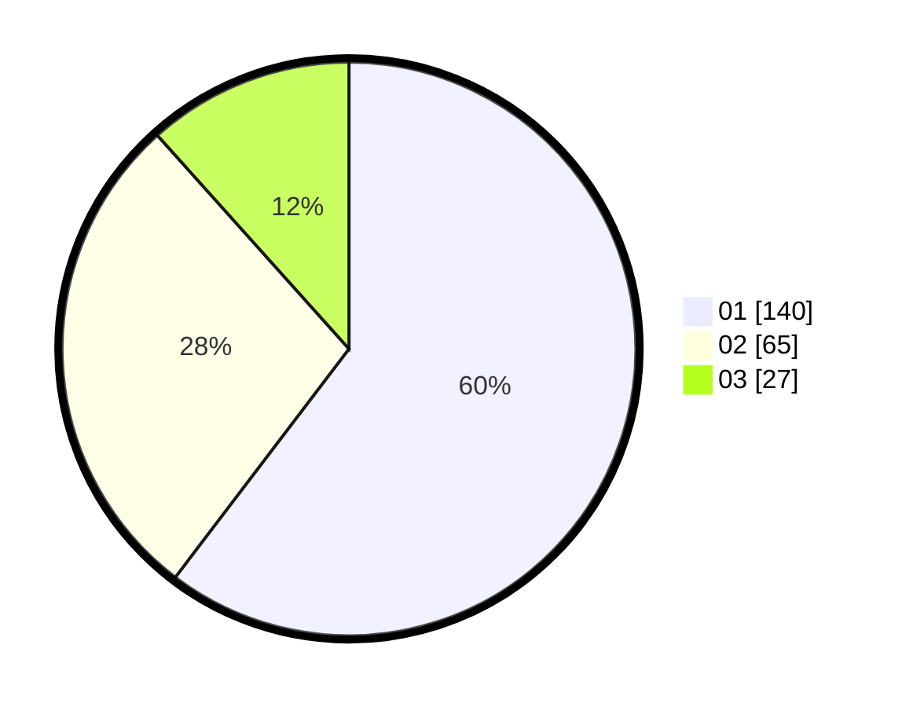

# Hasil

Hasil perolehan suara paslon dapat dilihat pada file paslon-01.txt, paslon-02.txt, dan paslon-03.txt.

Jika tidak ada, artinya data tersebut belum ada pada SIREKAP.

## Perolehan Suara

 * Paslon 01: **140**.
 * Paslon 02: **65**.
 * Paslon 03: **27**.

## Foto C Plano

https://sirekap-obj-formc.kpu.go.id/4cc9/pemilu/ppwp/31/74/03/10/01/3174031001031-20240215-021325--4ebc55df-0ea1-47ad-ab49-52d2b5b310c8.jpg

https://sirekap-obj-formc.kpu.go.id/4cc9/pemilu/ppwp/31/74/03/10/01/3174031001031-20240215-021329--12a4a6a4-2a48-452c-85d3-2af3f1b14ada.jpg

https://sirekap-obj-formc.kpu.go.id/4cc9/pemilu/ppwp/31/74/03/10/01/3174031001031-20240215-021332--c2364eca-28f9-4b49-87d1-256a90cdc099.jpg

## DATA PEMILIH TETAP

Jumlah pemilih dalam DPT: **267**.
 * L: **138**.
 * P: **129**.

## DATA PENGGUNA HAK PILIH

Jumlah pengguna hak pilih dalam DPT: **222**.
 * L: **113**.
 * P: **109**.

Jumlah pengguna hak pilih dalam DPTb: **9**.
 * L: **2**.
 * P: **7**.

Jumlah pengguna hak pilih dalam DPK: **6**.
 * L: **2**.
 * P: **4**.

Jumlah pengguna hak pilih: **237**.
 * L: **117**.
 * P: **120**.

## JUMLAH SUARA SAH DAN TIDAK SAH

JUMLAH SELURUH SUARA SAH: **232**.

JUMLAH SUARA TIDAK SAH: **5**.

JUMLAH SELURUH SUARA SAH DAN SUARA TIDAK SAH: **237**.
