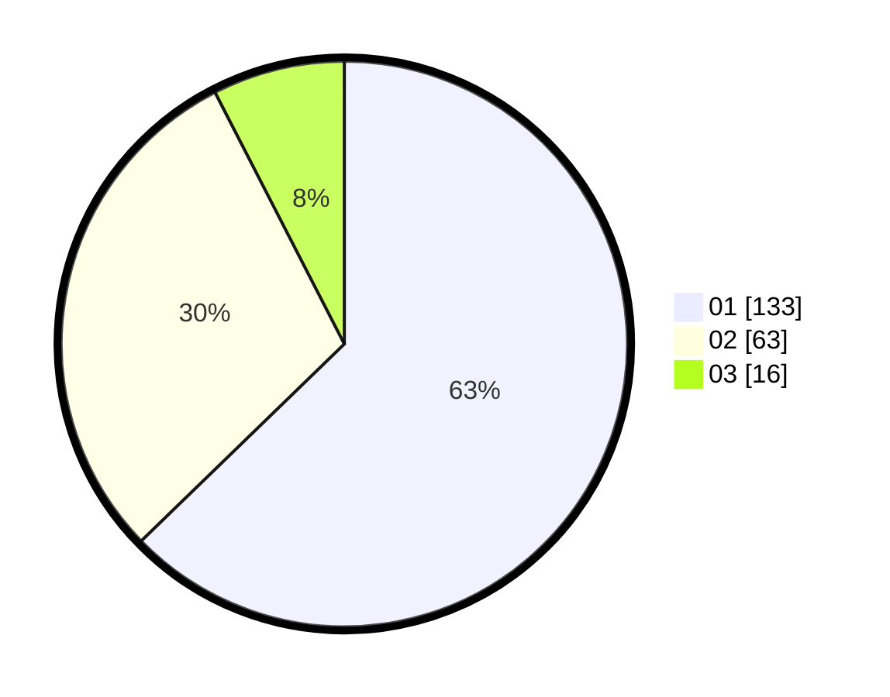

# Hasil

Hasil perolehan suara paslon dapat dilihat pada file paslon-01.txt, paslon-02.txt, dan paslon-03.txt.

Jika tidak ada, artinya data tersebut belum ada pada SIREKAP.

## Perolehan Suara

 * Paslon 01: **133**.
 * Paslon 02: **63**.
 * Paslon 03: **16**.

## Foto C Plano

https://sirekap-obj-formc.kpu.go.id/41f8/pemilu/ppwp/31/74/03/10/01/3174031001054-20240214-234323--6850a19a-33d4-4346-97a0-2dade625fd0b.jpg

https://sirekap-obj-formc.kpu.go.id/41f8/pemilu/ppwp/31/74/03/10/01/3174031001054-20240214-234422--8c928247-6a88-4ef9-b18a-c3824b03d24b.jpg

https://sirekap-obj-formc.kpu.go.id/41f8/pemilu/ppwp/31/74/03/10/01/3174031001054-20240214-234514--8c18a719-9733-4c42-a203-bf2594a00467.jpg

## DATA PEMILIH TETAP

Jumlah pemilih dalam DPT: **235**.
 * L: **108**.
 * P: **127**.

## DATA PENGGUNA HAK PILIH

Jumlah pengguna hak pilih dalam DPT: **205**.
 * L: **89**.
 * P: **116**.

Jumlah pengguna hak pilih dalam DPTb: **6**.
 * L: **2**.
 * P: **4**.

Jumlah pengguna hak pilih dalam DPK: **1**.
 * L: **1**.
 * P: **0**.

Jumlah pengguna hak pilih: **212**.
 * L: **92**.
 * P: **120**.

## JUMLAH SUARA SAH DAN TIDAK SAH

JUMLAH SELURUH SUARA SAH: **212**.

JUMLAH SUARA TIDAK SAH: **1**.

JUMLAH SELURUH SUARA SAH DAN SUARA TIDAK SAH: **213**.
