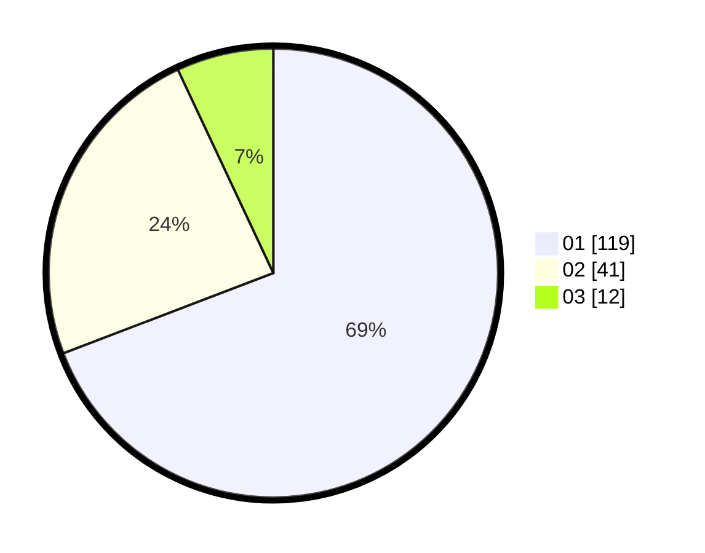

# Hasil

Hasil perolehan suara paslon dapat dilihat pada file paslon-01.txt, paslon-02.txt, dan paslon-03.txt.

Jika tidak ada, artinya data tersebut belum ada pada SIREKAP.

## Perolehan Suara

 * Paslon 01: **119**.
 * Paslon 02: **41**.
 * Paslon 03: **12**.

## Foto C Plano

https://sirekap-obj-formc.kpu.go.id/b519/pemilu/ppwp/31/74/03/10/01/3174031001059-20240216-145034--d0cc1fa8-1449-469d-98da-c59f71531e86.jpg

https://sirekap-obj-formc.kpu.go.id/b519/pemilu/ppwp/31/74/03/10/01/3174031001059-20240216-145035--fca21594-4b99-48f8-ba47-3873d8f25075.jpg

https://sirekap-obj-formc.kpu.go.id/b519/pemilu/ppwp/31/74/03/10/01/3174031001059-20240216-145035--32a75011-89bd-4424-bf6b-272bf952c6a0.jpg

## DATA PEMILIH TETAP

Jumlah pemilih dalam DPT: **223**.
 * L: **114**.
 * P: **109**.

## DATA PENGGUNA HAK PILIH

Jumlah pengguna hak pilih dalam DPT: **171**.
 * L: **88**.
 * P: **83**.

Jumlah pengguna hak pilih dalam DPTb: **0**.
 * L: **0**.
 * P: **0**.

Jumlah pengguna hak pilih dalam DPK: **2**.
 * L: **0**.
 * P: **2**.

Jumlah pengguna hak pilih: **173**.
 * L: **88**.
 * P: **85**.

## JUMLAH SUARA SAH DAN TIDAK SAH

JUMLAH SELURUH SUARA SAH: **172**.

JUMLAH SUARA TIDAK SAH: **1**.

JUMLAH SELURUH SUARA SAH DAN SUARA TIDAK SAH: **173**.
