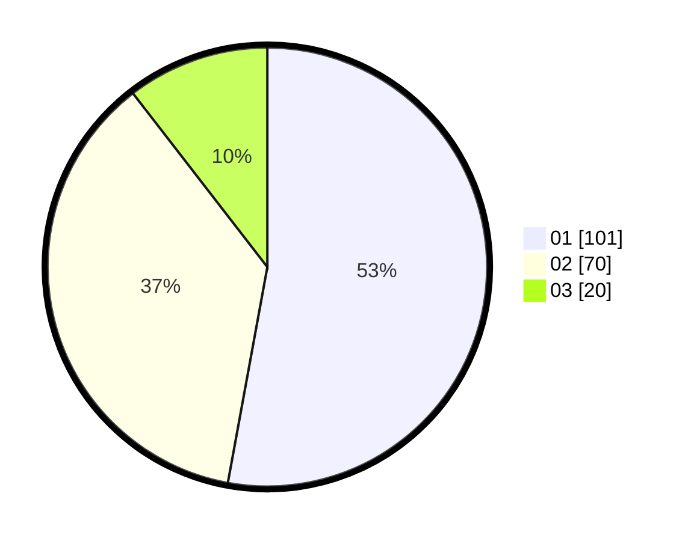

# Hasil

Hasil perolehan suara paslon dapat dilihat pada file paslon-01.txt, paslon-02.txt, dan paslon-03.txt.

Jika tidak ada, artinya data tersebut belum ada pada SIREKAP.

## Perolehan Suara

 * Paslon 01: **101**.
 * Paslon 02: **70**.
 * Paslon 03: **20**.

## Foto C Plano

https://sirekap-obj-formc.kpu.go.id/914c/pemilu/ppwp/31/74/03/10/02/3174031002001-20240215-225457--3931b863-b77f-48e5-b627-4ccaa33b14b9.jpg

https://sirekap-obj-formc.kpu.go.id/914c/pemilu/ppwp/31/74/03/10/02/3174031002001-20240215-225500--4b9fbebb-60fe-441a-b681-1ea40838f012.jpg

https://sirekap-obj-formc.kpu.go.id/914c/pemilu/ppwp/31/74/03/10/02/3174031002001-20240215-225459--b7a5ff8b-9938-4ec4-a681-a181582c765d.jpg

## DATA PEMILIH TETAP

Jumlah pemilih dalam DPT: **243**.
 * L: **129**.
 * P: **114**.

## DATA PENGGUNA HAK PILIH

Jumlah pengguna hak pilih dalam DPT: **186**.
 * L: **98**.
 * P: **88**.

Jumlah pengguna hak pilih dalam DPTb: **7**.
 * L: **2**.
 * P: **5**.

Jumlah pengguna hak pilih dalam DPK: **3**.
 * L: **1**.
 * P: **2**.

Jumlah pengguna hak pilih: **196**.
 * L: **101**.
 * P: **95**.

## JUMLAH SUARA SAH DAN TIDAK SAH

JUMLAH SELURUH SUARA SAH: **191**.

JUMLAH SUARA TIDAK SAH: **5**.

JUMLAH SELURUH SUARA SAH DAN SUARA TIDAK SAH: **196**.
