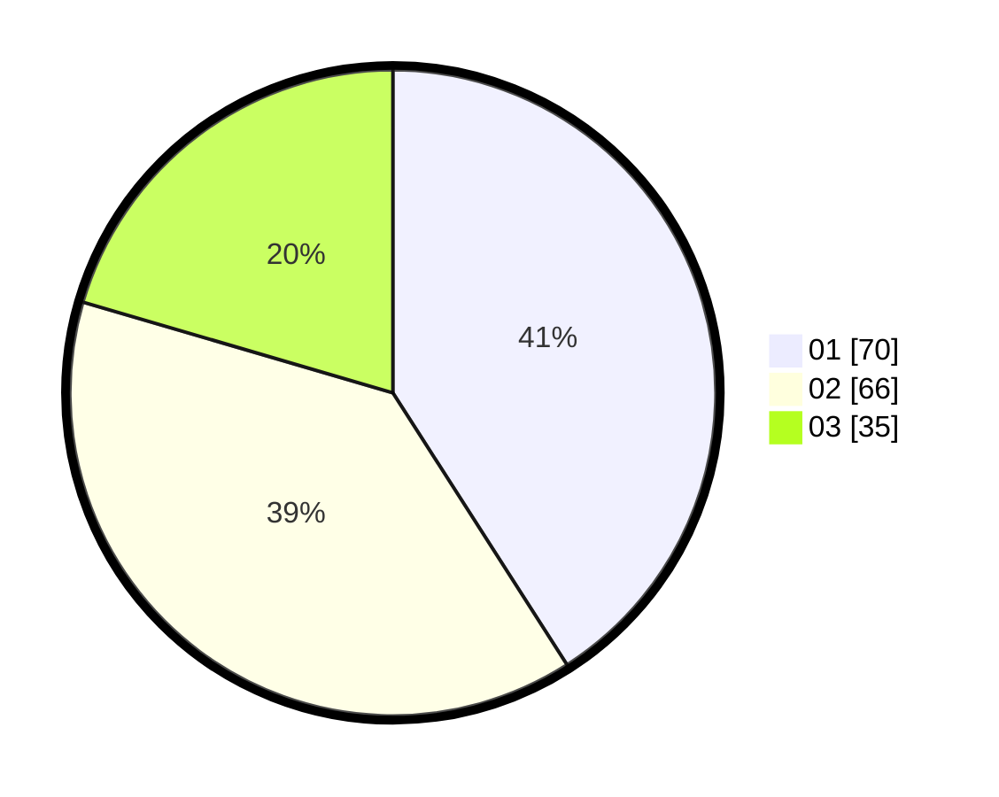

# Hasil

Hasil perolehan suara paslon dapat dilihat pada file paslon-01.txt, paslon-02.txt, dan paslon-03.txt.

Jika tidak ada, artinya data tersebut belum ada pada SIREKAP.

## Perolehan Suara

 * Paslon 01: **70**.
 * Paslon 02: **66**.
 * Paslon 03: **35**.

## Foto C Plano

https://sirekap-obj-formc.kpu.go.id/d78e/pemilu/ppwp/31/74/03/10/02/3174031002009-20240216-000612--7bd852cc-d6ae-4638-a6b5-68072c18f2ee.jpg

https://sirekap-obj-formc.kpu.go.id/d78e/pemilu/ppwp/31/74/03/10/02/3174031002009-20240216-000616--7cae51f2-e965-4898-a771-427edfad7c62.jpg

https://sirekap-obj-formc.kpu.go.id/d78e/pemilu/ppwp/31/74/03/10/02/3174031002009-20240216-000615--b80047c4-0d12-4de4-aa26-f566c498da11.jpg

## DATA PEMILIH TETAP

Jumlah pemilih dalam DPT: **0**.
 * L: **0**.
 * P: **0**.

## DATA PENGGUNA HAK PILIH

Jumlah pengguna hak pilih dalam DPT: **0**.
 * L: **0**.
 * P: **0**.

Jumlah pengguna hak pilih dalam DPTb: **0**.
 * L: **0**.
 * P: **0**.

Jumlah pengguna hak pilih dalam DPK: **0**.
 * L: **0**.
 * P: **0**.

Jumlah pengguna hak pilih: **0**.
 * L: **0**.
 * P: **0**.

## JUMLAH SUARA SAH DAN TIDAK SAH

JUMLAH SELURUH SUARA SAH: **171**.

JUMLAH SUARA TIDAK SAH: **2**.

JUMLAH SELURUH SUARA SAH DAN SUARA TIDAK SAH: **173**.
