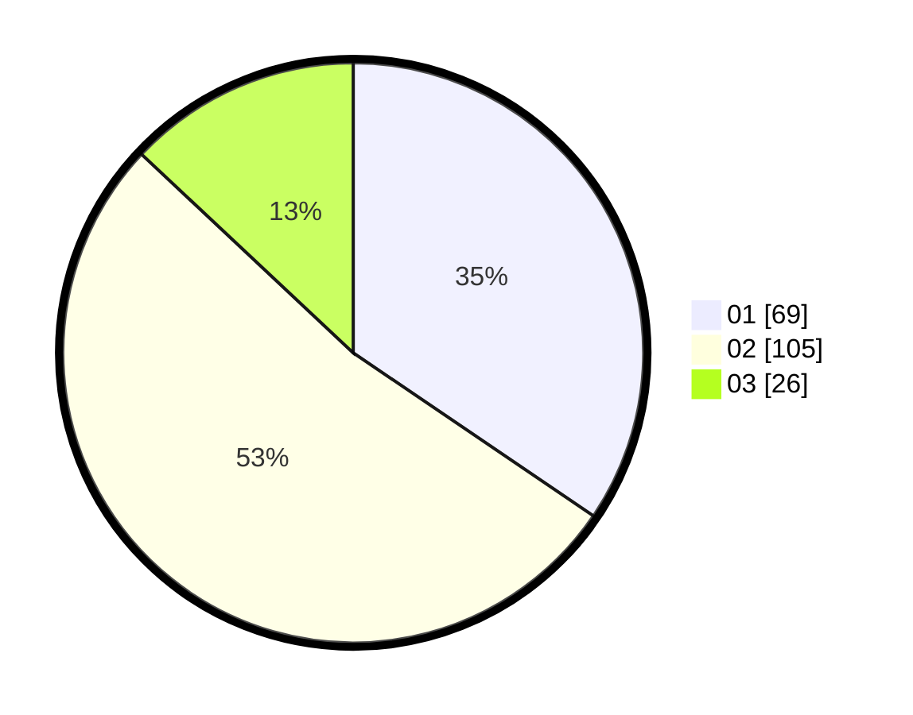

# Hasil

Hasil perolehan suara paslon dapat dilihat pada file paslon-01.txt, paslon-02.txt, dan paslon-03.txt.

Jika tidak ada, artinya data tersebut belum ada pada SIREKAP.

## Perolehan Suara

 * Paslon 01: **69**.
 * Paslon 02: **105**.
 * Paslon 03: **26**.

## Foto C Plano

https://sirekap-obj-formc.kpu.go.id/d79d/pemilu/ppwp/31/74/03/10/02/3174031002010-20240215-031312--80ff9321-a157-4379-b77c-635231c92874.jpg

https://sirekap-obj-formc.kpu.go.id/d79d/pemilu/ppwp/31/74/03/10/02/3174031002010-20240217-175311--235fd3ee-7003-45f5-bcde-415475030780.jpg

https://sirekap-obj-formc.kpu.go.id/d79d/pemilu/ppwp/31/74/03/10/02/3174031002010-20240215-013153--faa9036e-200e-4197-b0f7-208c173f576b.jpg

## DATA PEMILIH TETAP

Jumlah pemilih dalam DPT: **240**.
 * L: **114**.
 * P: **126**.

## DATA PENGGUNA HAK PILIH

Jumlah pengguna hak pilih dalam DPT: **197**.
 * L: **94**.
 * P: **103**.

Jumlah pengguna hak pilih dalam DPTb: **9**.
 * L: **2**.
 * P: **7**.

Jumlah pengguna hak pilih dalam DPK: **1**.
 * L: **1**.
 * P: **0**.

Jumlah pengguna hak pilih: **207**.
 * L: **97**.
 * P: **110**.

## JUMLAH SUARA SAH DAN TIDAK SAH

JUMLAH SELURUH SUARA SAH: **200**.

JUMLAH SUARA TIDAK SAH: **7**.

JUMLAH SELURUH SUARA SAH DAN SUARA TIDAK SAH: **207**.
