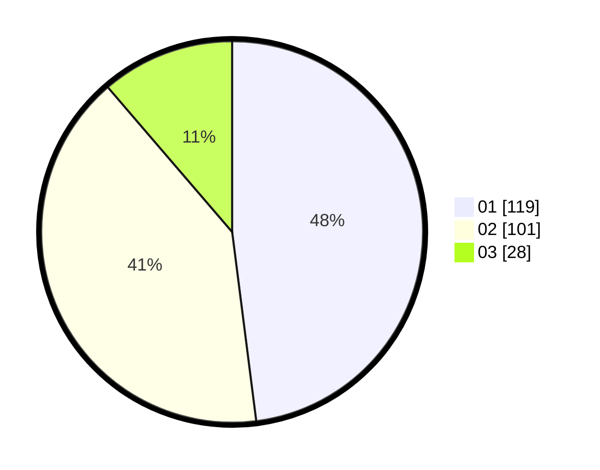

# Hasil

Hasil perolehan suara paslon dapat dilihat pada file paslon-01.txt, paslon-02.txt, dan paslon-03.txt.

Jika tidak ada, artinya data tersebut belum ada pada SIREKAP.

## Perolehan Suara

 * Paslon 01: **119**.
 * Paslon 02: **101**.
 * Paslon 03: **28**.

## Foto C Plano

https://sirekap-obj-formc.kpu.go.id/3367/pemilu/ppwp/31/74/03/10/02/3174031002012-20240216-144502--52a878ee-16a1-4a03-8bfd-ad0fa15813c5.jpg

https://sirekap-obj-formc.kpu.go.id/3367/pemilu/ppwp/31/74/03/10/02/3174031002012-20240216-144503--adc3be83-8e08-4bb4-ae72-25ce39f7b6c8.jpg

https://sirekap-obj-formc.kpu.go.id/3367/pemilu/ppwp/31/74/03/10/02/3174031002012-20240216-144502--d5d31cb8-16cf-4003-85b7-0ea823f81bff.jpg

## DATA PEMILIH TETAP

Jumlah pemilih dalam DPT: **291**.
 * L: **137**.
 * P: **154**.

## DATA PENGGUNA HAK PILIH

Jumlah pengguna hak pilih dalam DPT: **242**.
 * L: **115**.
 * P: **127**.

Jumlah pengguna hak pilih dalam DPTb: **7**.
 * L: **1**.
 * P: **6**.

Jumlah pengguna hak pilih dalam DPK: **0**.
 * L: **0**.
 * P: **0**.

Jumlah pengguna hak pilih: **249**.
 * L: **116**.
 * P: **133**.

## JUMLAH SUARA SAH DAN TIDAK SAH

JUMLAH SELURUH SUARA SAH: **248**.

JUMLAH SUARA TIDAK SAH: **1**.

JUMLAH SELURUH SUARA SAH DAN SUARA TIDAK SAH: **249**.
