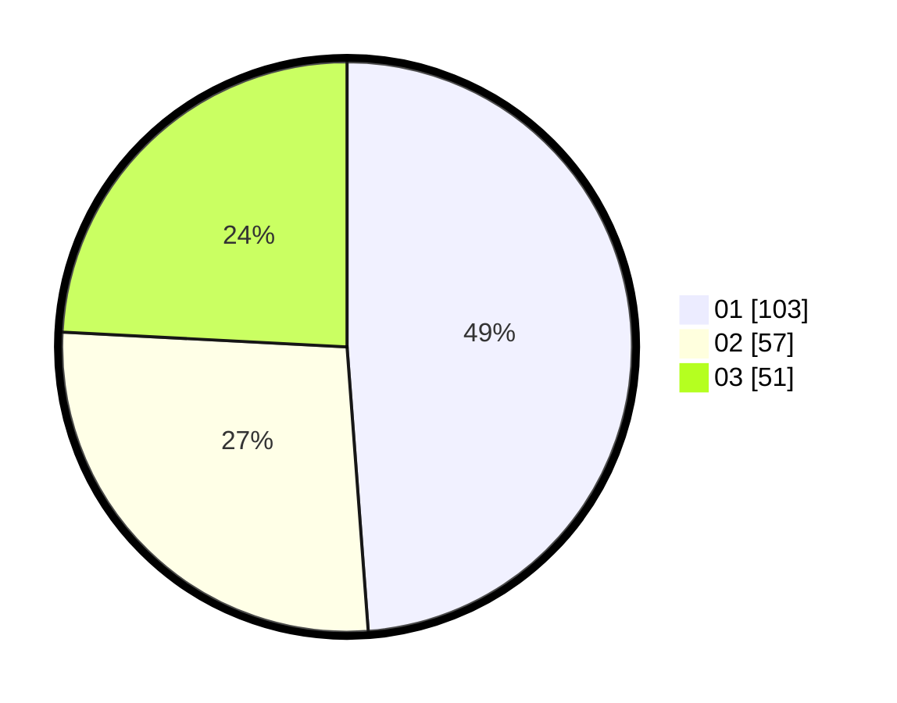

# Hasil

Hasil perolehan suara paslon dapat dilihat pada file paslon-01.txt, paslon-02.txt, dan paslon-03.txt.

Jika tidak ada, artinya data tersebut belum ada pada SIREKAP.

## Perolehan Suara

 * Paslon 01: **103**.
 * Paslon 02: **57**.
 * Paslon 03: **51**.

## Foto C Plano

https://sirekap-obj-formc.kpu.go.id/33a0/pemilu/ppwp/31/74/03/10/02/3174031002022-20240214-220132--727fdc48-8451-4640-80c7-84a60822f772.jpg

https://sirekap-obj-formc.kpu.go.id/33a0/pemilu/ppwp/31/74/03/10/02/3174031002022-20240214-220153--c092c217-7247-4b81-a976-9dd44362a96d.jpg

https://sirekap-obj-formc.kpu.go.id/33a0/pemilu/ppwp/31/74/03/10/02/3174031002022-20240214-220143--57ee2198-edb2-4665-a7d1-ca9cd40f3eca.jpg

## DATA PEMILIH TETAP

Jumlah pemilih dalam DPT: **241**.
 * L: **100**.
 * P: **141**.

## DATA PENGGUNA HAK PILIH

Jumlah pengguna hak pilih dalam DPT: **199**.
 * L: **84**.
 * P: **115**.

Jumlah pengguna hak pilih dalam DPTb: **10**.
 * L: **5**.
 * P: **5**.

Jumlah pengguna hak pilih dalam DPK: **3**.
 * L: **3**.
 * P: **0**.

Jumlah pengguna hak pilih: **212**.
 * L: **92**.
 * P: **120**.

## JUMLAH SUARA SAH DAN TIDAK SAH

JUMLAH SELURUH SUARA SAH: **211**.

JUMLAH SUARA TIDAK SAH: **3**.

JUMLAH SELURUH SUARA SAH DAN SUARA TIDAK SAH: **214**.
