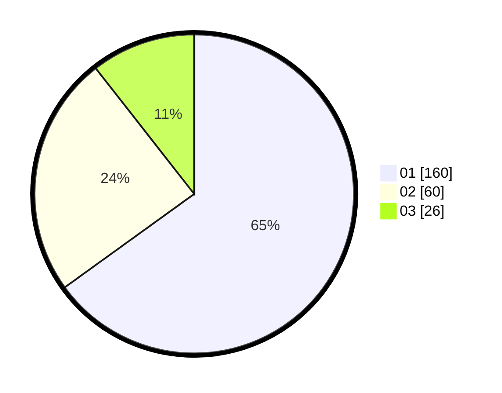

# Hasil

Hasil perolehan suara paslon dapat dilihat pada file paslon-01.txt, paslon-02.txt, dan paslon-03.txt.

Jika tidak ada, artinya data tersebut belum ada pada SIREKAP.

## Perolehan Suara

 * Paslon 01: **160**.
 * Paslon 02: **60**.
 * Paslon 03: **26**.

## Foto C Plano

https://sirekap-obj-formc.kpu.go.id/ce50/pemilu/ppwp/31/74/03/10/02/3174031002024-20240216-135758--311be067-589c-4022-84d5-a1570ba2a53c.jpg

https://sirekap-obj-formc.kpu.go.id/ce50/pemilu/ppwp/31/74/03/10/02/3174031002024-20240216-135759--59f49fd2-db3e-4880-8510-a1dfeb1f9320.jpg

https://sirekap-obj-formc.kpu.go.id/ce50/pemilu/ppwp/31/74/03/10/02/3174031002024-20240216-135758--c7de78a3-1e88-4278-be1c-0b13f8908098.jpg

## DATA PEMILIH TETAP

Jumlah pemilih dalam DPT: **264**.
 * L: **141**.
 * P: **123**.

## DATA PENGGUNA HAK PILIH

Jumlah pengguna hak pilih dalam DPT: **240**.
 * L: **123**.
 * P: **117**.

Jumlah pengguna hak pilih dalam DPTb: **2**.
 * L: **0**.
 * P: **2**.

Jumlah pengguna hak pilih dalam DPK: **7**.
 * L: **2**.
 * P: **5**.

Jumlah pengguna hak pilih: **249**.
 * L: **125**.
 * P: **124**.

## JUMLAH SUARA SAH DAN TIDAK SAH

JUMLAH SELURUH SUARA SAH: **246**.

JUMLAH SUARA TIDAK SAH: **3**.

JUMLAH SELURUH SUARA SAH DAN SUARA TIDAK SAH: **249**.
