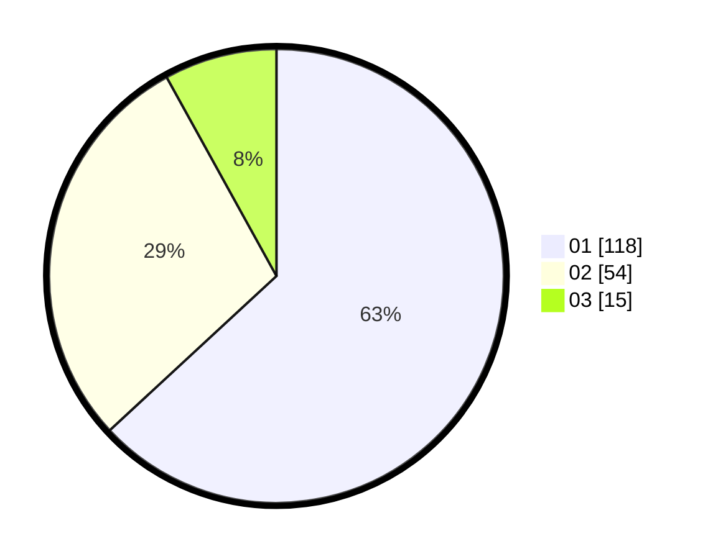

# Hasil

Hasil perolehan suara paslon dapat dilihat pada file paslon-01.txt, paslon-02.txt, dan paslon-03.txt.

Jika tidak ada, artinya data tersebut belum ada pada SIREKAP.

## Perolehan Suara

 * Paslon 01: **118**.
 * Paslon 02: **54**.
 * Paslon 03: **15**.

## Foto C Plano

https://sirekap-obj-formc.kpu.go.id/e40d/pemilu/ppwp/31/74/03/10/02/3174031002026-20240215-222422--6f6e645e-b309-40f5-93b0-7ebb521c4125.jpg

https://sirekap-obj-formc.kpu.go.id/e40d/pemilu/ppwp/31/74/03/10/02/3174031002026-20240215-222424--85de9ca4-e93d-48ab-9ddb-6b15d656993d.jpg

https://sirekap-obj-formc.kpu.go.id/e40d/pemilu/ppwp/31/74/03/10/02/3174031002026-20240215-222423--46c3b3a6-76ff-4c45-879b-00a3c8afeadc.jpg

## DATA PEMILIH TETAP

Jumlah pemilih dalam DPT: **204**.
 * L: **101**.
 * P: **103**.

## DATA PENGGUNA HAK PILIH

Jumlah pengguna hak pilih dalam DPT: **174**.
 * L: **84**.
 * P: **90**.

Jumlah pengguna hak pilih dalam DPTb: **12**.
 * L: **5**.
 * P: **7**.

Jumlah pengguna hak pilih dalam DPK: **1**.
 * L: **0**.
 * P: **1**.

Jumlah pengguna hak pilih: **187**.
 * L: **89**.
 * P: **98**.

## JUMLAH SUARA SAH DAN TIDAK SAH

JUMLAH SELURUH SUARA SAH: **187**.

JUMLAH SUARA TIDAK SAH: **0**.

JUMLAH SELURUH SUARA SAH DAN SUARA TIDAK SAH: **187**.
