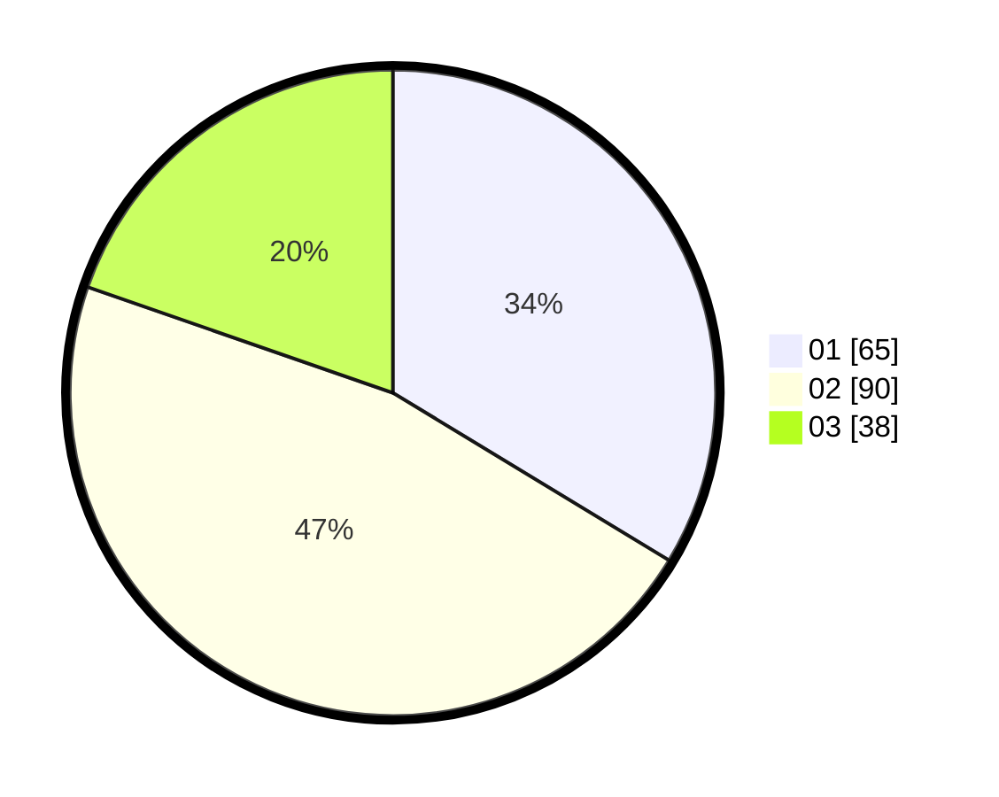

# Hasil

Hasil perolehan suara paslon dapat dilihat pada file paslon-01.txt, paslon-02.txt, dan paslon-03.txt.

Jika tidak ada, artinya data tersebut belum ada pada SIREKAP.

## Perolehan Suara

 * Paslon 01: **65**.
 * Paslon 02: **90**.
 * Paslon 03: **38**.

## Foto C Plano

https://sirekap-obj-formc.kpu.go.id/6ddb/pemilu/ppwp/31/74/03/10/02/3174031002029-20240215-223644--5f014029-5631-4a3f-ae08-a88a8372c4cf.jpg

https://sirekap-obj-formc.kpu.go.id/6ddb/pemilu/ppwp/31/74/03/10/02/3174031002029-20240215-223647--6e707279-ff77-48a8-b2e1-6da020d7452b.jpg

https://sirekap-obj-formc.kpu.go.id/6ddb/pemilu/ppwp/31/74/03/10/02/3174031002029-20240215-223645--081e9149-404a-42d5-a407-bf49d08bf0cd.jpg

## DATA PEMILIH TETAP

Jumlah pemilih dalam DPT: **0**.
 * L: **0**.
 * P: **0**.

## DATA PENGGUNA HAK PILIH

Jumlah pengguna hak pilih dalam DPT: **0**.
 * L: **0**.
 * P: **0**.

Jumlah pengguna hak pilih dalam DPTb: **0**.
 * L: **0**.
 * P: **0**.

Jumlah pengguna hak pilih dalam DPK: **0**.
 * L: **0**.
 * P: **0**.

Jumlah pengguna hak pilih: **0**.
 * L: **0**.
 * P: **0**.

## JUMLAH SUARA SAH DAN TIDAK SAH

JUMLAH SELURUH SUARA SAH: **193**.

JUMLAH SUARA TIDAK SAH: **3**.

JUMLAH SELURUH SUARA SAH DAN SUARA TIDAK SAH: **196**.
