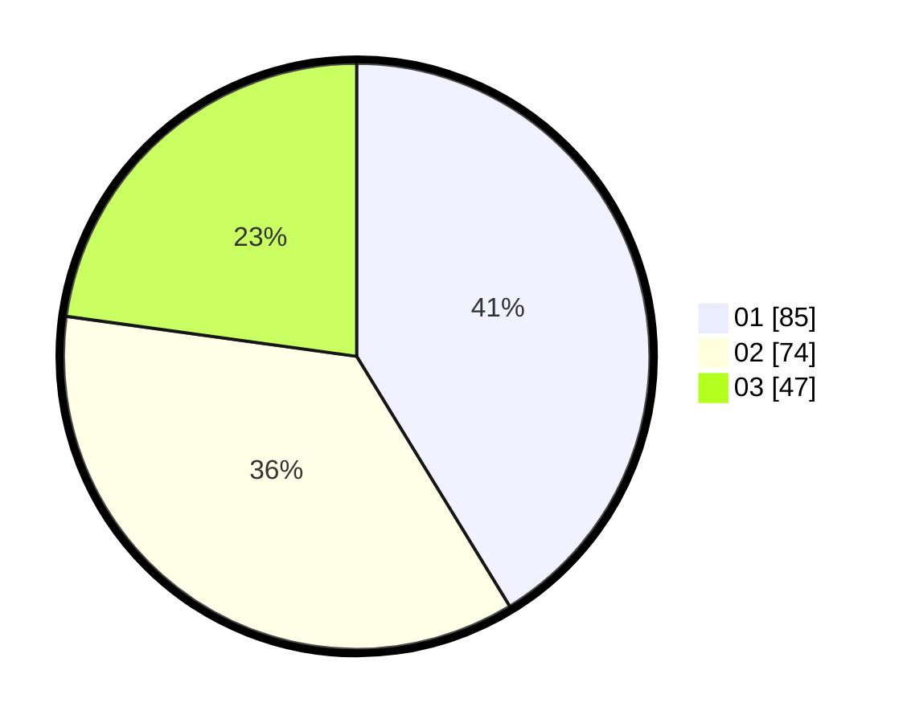

# Hasil

Hasil perolehan suara paslon dapat dilihat pada file paslon-01.txt, paslon-02.txt, dan paslon-03.txt.

Jika tidak ada, artinya data tersebut belum ada pada SIREKAP.

## Perolehan Suara

 * Paslon 01: **85**.
 * Paslon 02: **74**.
 * Paslon 03: **47**.

## Foto C Plano

https://sirekap-obj-formc.kpu.go.id/5431/pemilu/ppwp/31/74/03/10/02/3174031002033-20240216-071229--a4fd177a-d758-443d-b24f-afca00e3b4b0.jpg

https://sirekap-obj-formc.kpu.go.id/5431/pemilu/ppwp/31/74/03/10/02/3174031002033-20240216-071231--6f270ca9-8cc8-4b44-bc22-9c55b52b8efa.jpg

https://sirekap-obj-formc.kpu.go.id/5431/pemilu/ppwp/31/74/03/10/02/3174031002033-20240216-071230--c9c8d236-17d2-42f0-a7fb-43182959ced3.jpg

## DATA PEMILIH TETAP

Jumlah pemilih dalam DPT: **259**.
 * L: **119**.
 * P: **140**.

## DATA PENGGUNA HAK PILIH

Jumlah pengguna hak pilih dalam DPT: **199**.
 * L: **93**.
 * P: **106**.

Jumlah pengguna hak pilih dalam DPTb: **11**.
 * L: **7**.
 * P: **4**.

Jumlah pengguna hak pilih dalam DPK: **0**.
 * L: **0**.
 * P: **0**.

Jumlah pengguna hak pilih: **210**.
 * L: **100**.
 * P: **110**.

## JUMLAH SUARA SAH DAN TIDAK SAH

JUMLAH SELURUH SUARA SAH: **206**.

JUMLAH SUARA TIDAK SAH: **4**.

JUMLAH SELURUH SUARA SAH DAN SUARA TIDAK SAH: **210**.
