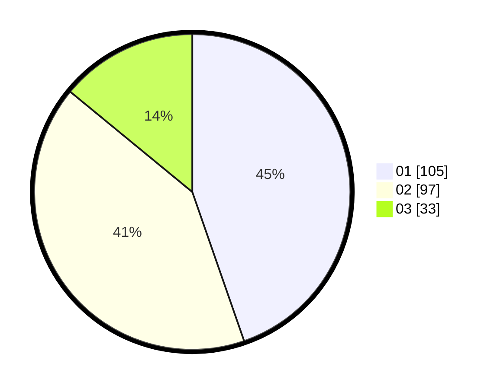

# Hasil

Hasil perolehan suara paslon dapat dilihat pada file paslon-01.txt, paslon-02.txt, dan paslon-03.txt.

Jika tidak ada, artinya data tersebut belum ada pada SIREKAP.

## Perolehan Suara

 * Paslon 01: **105**.
 * Paslon 02: **97**.
 * Paslon 03: **33**.

## Foto C Plano

https://sirekap-obj-formc.kpu.go.id/f5a0/pemilu/ppwp/31/74/03/10/02/3174031002040-20240216-043447--ac968ba5-e7b7-4c27-ba93-7b89e9b5dcb1.jpg

https://sirekap-obj-formc.kpu.go.id/f5a0/pemilu/ppwp/31/74/03/10/02/3174031002040-20240216-043449--9f2300b7-2e94-423a-8353-da40cb9494b9.jpg

https://sirekap-obj-formc.kpu.go.id/f5a0/pemilu/ppwp/31/74/03/10/02/3174031002040-20240216-043448--e6f78dd1-a878-4ff1-a4c7-fd6f4ab7dfb1.jpg

## DATA PEMILIH TETAP

Jumlah pemilih dalam DPT: **288**.
 * L: **158**.
 * P: **130**.

## DATA PENGGUNA HAK PILIH

Jumlah pengguna hak pilih dalam DPT: **227**.
 * L: **115**.
 * P: **112**.

Jumlah pengguna hak pilih dalam DPTb: **14**.
 * L: **9**.
 * P: **5**.

Jumlah pengguna hak pilih dalam DPK: **0**.
 * L: **0**.
 * P: **0**.

Jumlah pengguna hak pilih: **241**.
 * L: **124**.
 * P: **117**.

## JUMLAH SUARA SAH DAN TIDAK SAH

JUMLAH SELURUH SUARA SAH: **235**.

JUMLAH SUARA TIDAK SAH: **6**.

JUMLAH SELURUH SUARA SAH DAN SUARA TIDAK SAH: **241**.
