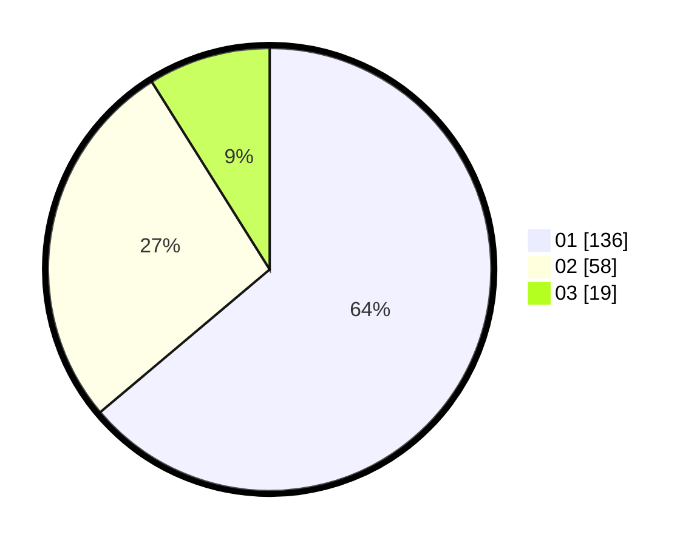

# Hasil

Hasil perolehan suara paslon dapat dilihat pada file paslon-01.txt, paslon-02.txt, dan paslon-03.txt.

Jika tidak ada, artinya data tersebut belum ada pada SIREKAP.

## Perolehan Suara

 * Paslon 01: **136**.
 * Paslon 02: **58**.
 * Paslon 03: **19**.

## Foto C Plano

https://sirekap-obj-formc.kpu.go.id/8a70/pemilu/ppwp/31/74/03/10/02/3174031002043-20240215-182217--08087b5f-fd14-4e6a-b370-bae506f8d8e2.jpg

https://sirekap-obj-formc.kpu.go.id/8a70/pemilu/ppwp/31/74/03/10/02/3174031002043-20240215-182246--6181f5b8-8bd0-4bf9-a90b-97ccd254a258.jpg

https://sirekap-obj-formc.kpu.go.id/8a70/pemilu/ppwp/31/74/03/10/02/3174031002043-20240215-182228--f6c51a6b-5f6c-44a9-a60d-ad9a97d98de6.jpg

## DATA PEMILIH TETAP

Jumlah pemilih dalam DPT: **257**.
 * L: **131**.
 * P: **126**.

## DATA PENGGUNA HAK PILIH

Jumlah pengguna hak pilih dalam DPT: **213**.
 * L: **102**.
 * P: **111**.

Jumlah pengguna hak pilih dalam DPTb: **2**.
 * L: **1**.
 * P: **1**.

Jumlah pengguna hak pilih dalam DPK: **0**.
 * L: **0**.
 * P: **0**.

Jumlah pengguna hak pilih: **215**.
 * L: **103**.
 * P: **112**.

## JUMLAH SUARA SAH DAN TIDAK SAH

JUMLAH SELURUH SUARA SAH: **213**.

JUMLAH SUARA TIDAK SAH: **2**.

JUMLAH SELURUH SUARA SAH DAN SUARA TIDAK SAH: **215**.
