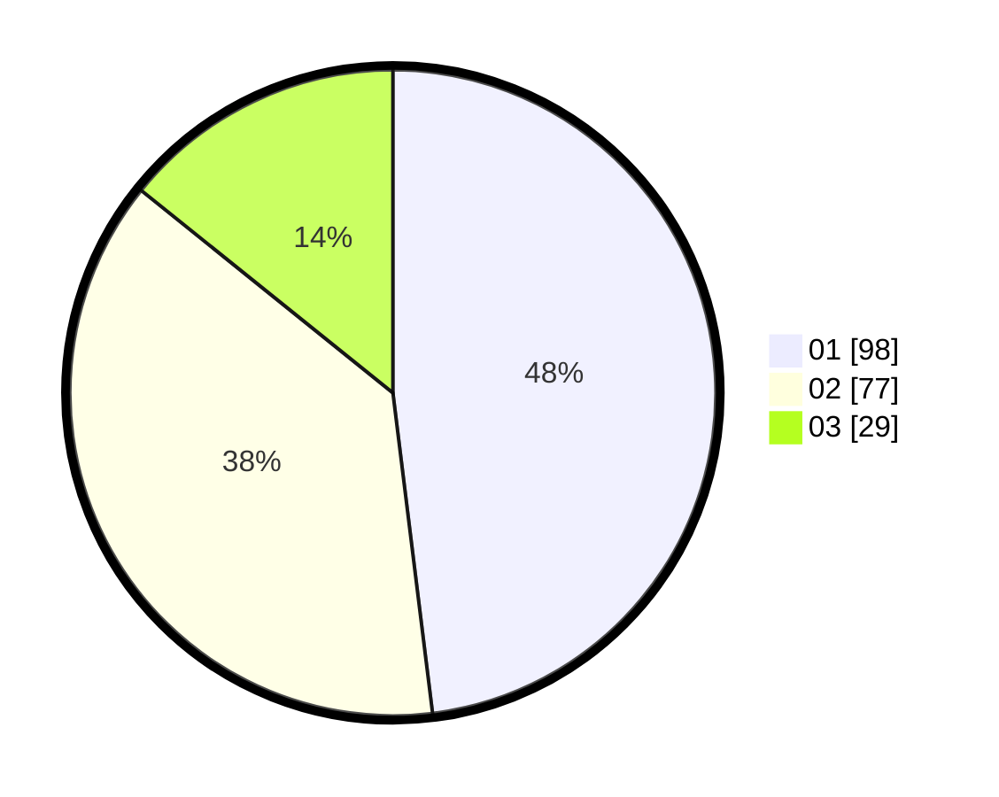

# Hasil

Hasil perolehan suara paslon dapat dilihat pada file paslon-01.txt, paslon-02.txt, dan paslon-03.txt.

Jika tidak ada, artinya data tersebut belum ada pada SIREKAP.

## Perolehan Suara

 * Paslon 01: **98**.
 * Paslon 02: **77**.
 * Paslon 03: **29**.

## Foto C Plano

https://sirekap-obj-formc.kpu.go.id/94c3/pemilu/ppwp/31/74/03/10/02/3174031002051-20240216-015748--406500f7-2b38-448c-be2d-0467e7a3a80f.jpg

https://sirekap-obj-formc.kpu.go.id/94c3/pemilu/ppwp/31/74/03/10/02/3174031002051-20240216-015749--52f1d1eb-1648-4243-8843-6c1b0899e6f7.jpg

https://sirekap-obj-formc.kpu.go.id/94c3/pemilu/ppwp/31/74/03/10/02/3174031002051-20240216-150231--5192731a-3a91-4991-95c3-d5efa0eab7d6.jpg

## DATA PEMILIH TETAP

Jumlah pemilih dalam DPT: **244**.
 * L: **132**.
 * P: **112**.

## DATA PENGGUNA HAK PILIH

Jumlah pengguna hak pilih dalam DPT: **205**.
 * L: **106**.
 * P: **99**.

Jumlah pengguna hak pilih dalam DPTb: **2**.
 * L: **1**.
 * P: **1**.

Jumlah pengguna hak pilih dalam DPK: **1**.
 * L: **1**.
 * P: **0**.

Jumlah pengguna hak pilih: **208**.
 * L: **108**.
 * P: **100**.

## JUMLAH SUARA SAH DAN TIDAK SAH

JUMLAH SELURUH SUARA SAH: **204**.

JUMLAH SUARA TIDAK SAH: **4**.

JUMLAH SELURUH SUARA SAH DAN SUARA TIDAK SAH: **208**.
