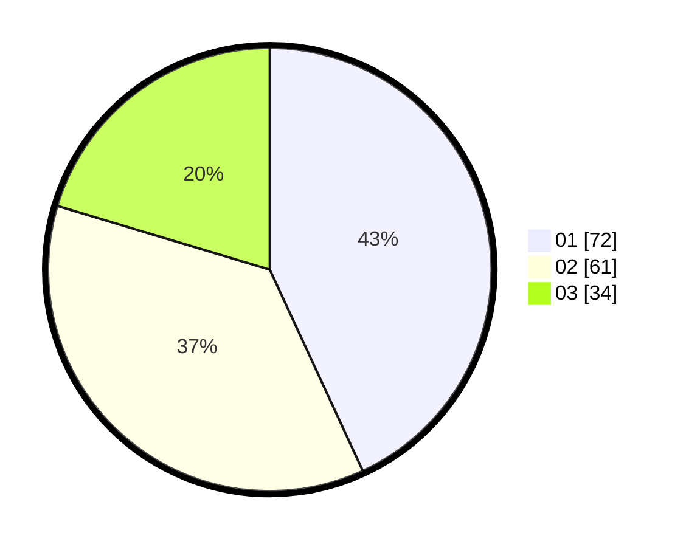

# Hasil

Hasil perolehan suara paslon dapat dilihat pada file paslon-01.txt, paslon-02.txt, dan paslon-03.txt.

Jika tidak ada, artinya data tersebut belum ada pada SIREKAP.

## Perolehan Suara

 * Paslon 01: **72**.
 * Paslon 02: **61**.
 * Paslon 03: **34**.

## Foto C Plano

https://sirekap-obj-formc.kpu.go.id/b15d/pemilu/ppwp/31/74/03/10/02/3174031002057-20240216-091515--61f7130d-f91d-4caa-a701-f74938905545.jpg

https://sirekap-obj-formc.kpu.go.id/b15d/pemilu/ppwp/31/74/03/10/02/3174031002057-20240216-091520--0a59f13a-2d62-480c-a982-b8fef73307e2.jpg

https://sirekap-obj-formc.kpu.go.id/b15d/pemilu/ppwp/31/74/03/10/02/3174031002057-20240216-091516--e95f34dd-40bf-4e9c-84e2-01a5b91f5003.jpg

## DATA PEMILIH TETAP

Jumlah pemilih dalam DPT: **235**.
 * L: **126**.
 * P: **109**.

## DATA PENGGUNA HAK PILIH

Jumlah pengguna hak pilih dalam DPT: **177**.
 * L: **93**.
 * P: **84**.

Jumlah pengguna hak pilih dalam DPTb: **0**.
 * L: **0**.
 * P: **0**.

Jumlah pengguna hak pilih dalam DPK: **0**.
 * L: **0**.
 * P: **0**.

Jumlah pengguna hak pilih: **177**.
 * L: **93**.
 * P: **84**.

## JUMLAH SUARA SAH DAN TIDAK SAH

JUMLAH SELURUH SUARA SAH: **167**.

JUMLAH SUARA TIDAK SAH: **10**.

JUMLAH SELURUH SUARA SAH DAN SUARA TIDAK SAH: **177**.
