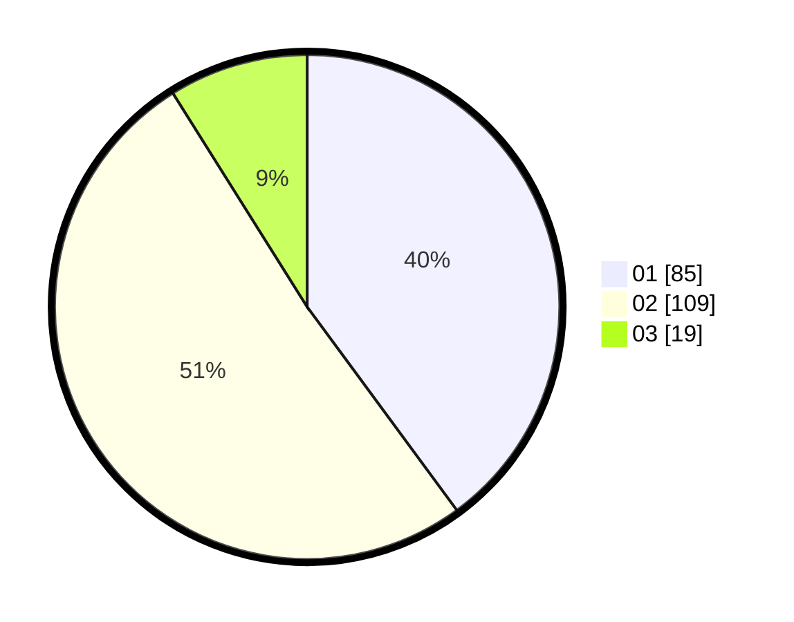

# Hasil

Hasil perolehan suara paslon dapat dilihat pada file paslon-01.txt, paslon-02.txt, dan paslon-03.txt.

Jika tidak ada, artinya data tersebut belum ada pada SIREKAP.

## Perolehan Suara

 * Paslon 01: **85**.
 * Paslon 02: **109**.
 * Paslon 03: **19**.

## Foto C Plano

https://sirekap-obj-formc.kpu.go.id/0ed2/pemilu/ppwp/31/74/03/10/02/3174031002058-20240214-155043--8fd9a86e-422c-473f-8d3b-871c7630ef9f.jpg

https://sirekap-obj-formc.kpu.go.id/0ed2/pemilu/ppwp/31/74/03/10/02/3174031002058-20240217-003241--83be8b5d-dd89-4157-a8c3-b728cb8b0e29.jpg

https://sirekap-obj-formc.kpu.go.id/0ed2/pemilu/ppwp/31/74/03/10/02/3174031002058-20240217-003241--e9e5c4b7-c396-4985-9eee-258a3a622203.jpg

## DATA PEMILIH TETAP

Jumlah pemilih dalam DPT: **268**.
 * L: **129**.
 * P: **139**.

## DATA PENGGUNA HAK PILIH

Jumlah pengguna hak pilih dalam DPT: **215**.
 * L: **102**.
 * P: **113**.

Jumlah pengguna hak pilih dalam DPTb: **2**.
 * L: **0**.
 * P: **2**.

Jumlah pengguna hak pilih dalam DPK: **3**.
 * L: **2**.
 * P: **1**.

Jumlah pengguna hak pilih: **220**.
 * L: **104**.
 * P: **116**.

## JUMLAH SUARA SAH DAN TIDAK SAH

JUMLAH SELURUH SUARA SAH: **213**.

JUMLAH SUARA TIDAK SAH: **7**.

JUMLAH SELURUH SUARA SAH DAN SUARA TIDAK SAH: **220**.
