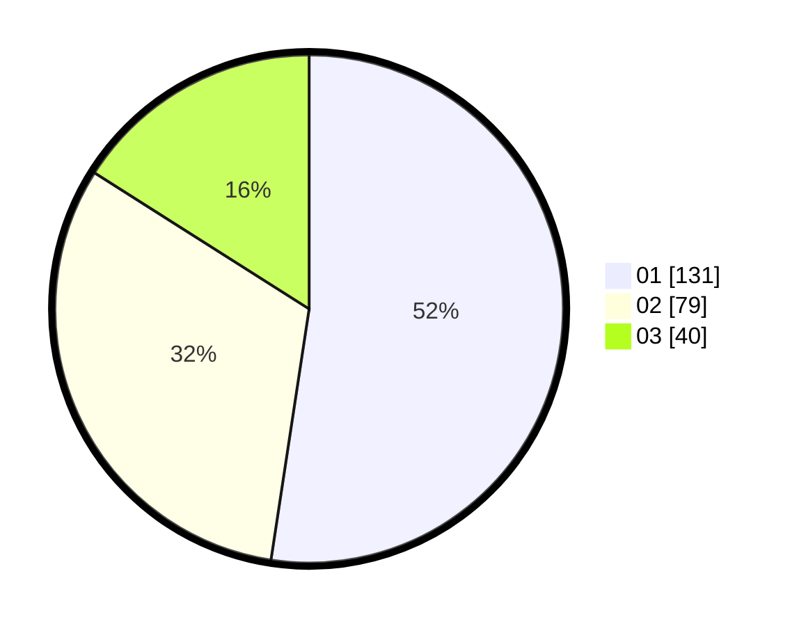

# Hasil

Hasil perolehan suara paslon dapat dilihat pada file paslon-01.txt, paslon-02.txt, dan paslon-03.txt.

Jika tidak ada, artinya data tersebut belum ada pada SIREKAP.

## Perolehan Suara

 * Paslon 01: **131**.
 * Paslon 02: **79**.
 * Paslon 03: **40**.

## Foto C Plano

https://sirekap-obj-formc.kpu.go.id/4326/pemilu/ppwp/31/74/03/10/02/3174031002063-20240216-025853--402d52d7-b3c4-45af-9d52-bbfc4c77557a.jpg

https://sirekap-obj-formc.kpu.go.id/4326/pemilu/ppwp/31/74/03/10/02/3174031002063-20240216-022352--98f3399e-514d-40ab-a939-05bf7571f553.jpg

https://sirekap-obj-formc.kpu.go.id/4326/pemilu/ppwp/31/74/03/10/02/3174031002063-20240216-022347--3c14f5b0-0d48-4c6c-912d-871107e6563c.jpg

## DATA PEMILIH TETAP

Jumlah pemilih dalam DPT: **290**.
 * L: **142**.
 * P: **148**.

## DATA PENGGUNA HAK PILIH

Jumlah pengguna hak pilih dalam DPT: **235**.
 * L: **115**.
 * P: **120**.

Jumlah pengguna hak pilih dalam DPTb: **13**.
 * L: **3**.
 * P: **10**.

Jumlah pengguna hak pilih dalam DPK: **4**.
 * L: **2**.
 * P: **2**.

Jumlah pengguna hak pilih: **252**.
 * L: **120**.
 * P: **132**.

## JUMLAH SUARA SAH DAN TIDAK SAH

JUMLAH SELURUH SUARA SAH: **250**.

JUMLAH SUARA TIDAK SAH: **2**.

JUMLAH SELURUH SUARA SAH DAN SUARA TIDAK SAH: **252**.
