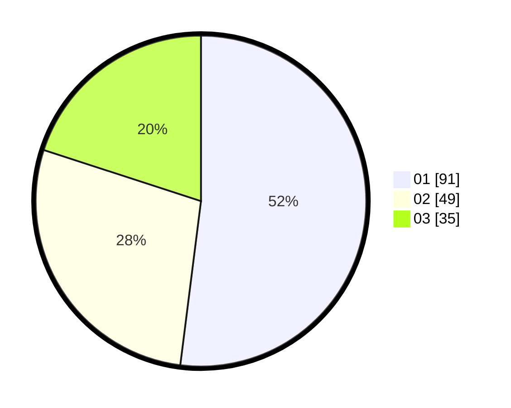

# Hasil

Hasil perolehan suara paslon dapat dilihat pada file paslon-01.txt, paslon-02.txt, dan paslon-03.txt.

Jika tidak ada, artinya data tersebut belum ada pada SIREKAP.

## Perolehan Suara

 * Paslon 01: **91**.
 * Paslon 02: **49**.
 * Paslon 03: **35**.

## Foto C Plano

https://sirekap-obj-formc.kpu.go.id/28c1/pemilu/ppwp/31/74/03/10/02/3174031002065-20240215-215130--306d1951-c098-4394-afc6-d5c01e1a9282.jpg

https://sirekap-obj-formc.kpu.go.id/28c1/pemilu/ppwp/31/74/03/10/02/3174031002065-20240215-215131--5836fce0-230d-4db6-aced-02cc434bcf6a.jpg

https://sirekap-obj-formc.kpu.go.id/28c1/pemilu/ppwp/31/74/03/10/02/3174031002065-20240215-215130--14ac7481-a47b-4cf4-a78d-3d30321771fd.jpg

## DATA PEMILIH TETAP

Jumlah pemilih dalam DPT: **211**.
 * L: **108**.
 * P: **103**.

## DATA PENGGUNA HAK PILIH

Jumlah pengguna hak pilih dalam DPT: **172**.
 * L: **89**.
 * P: **83**.

Jumlah pengguna hak pilih dalam DPTb: **1**.
 * L: **1**.
 * P: **0**.

Jumlah pengguna hak pilih dalam DPK: **3**.
 * L: **2**.
 * P: **1**.

Jumlah pengguna hak pilih: **176**.
 * L: **92**.
 * P: **84**.

## JUMLAH SUARA SAH DAN TIDAK SAH

JUMLAH SELURUH SUARA SAH: **175**.

JUMLAH SUARA TIDAK SAH: **1**.

JUMLAH SELURUH SUARA SAH DAN SUARA TIDAK SAH: **176**.
