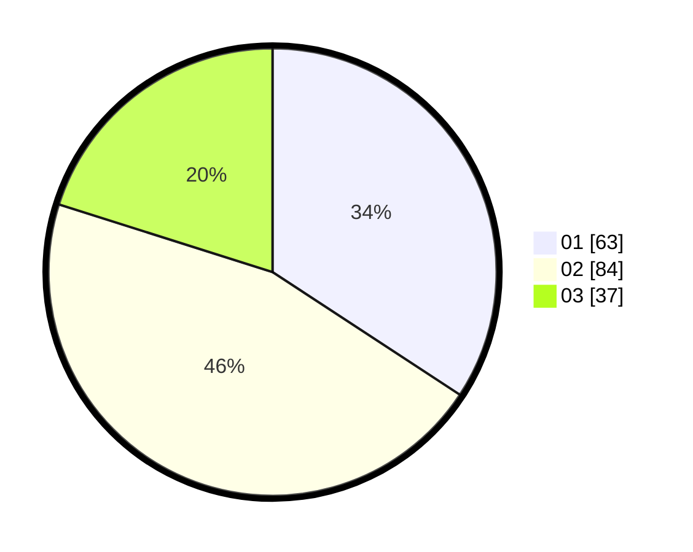

# Hasil

Hasil perolehan suara paslon dapat dilihat pada file paslon-01.txt, paslon-02.txt, dan paslon-03.txt.

Jika tidak ada, artinya data tersebut belum ada pada SIREKAP.

## Perolehan Suara

 * Paslon 01: **63**.
 * Paslon 02: **84**.
 * Paslon 03: **37**.

## Foto C Plano

https://sirekap-obj-formc.kpu.go.id/0ac8/pemilu/ppwp/31/74/03/10/02/3174031002066-20240216-125139--cab64ddb-af55-420b-8249-46e219fc1f07.jpg

https://sirekap-obj-formc.kpu.go.id/0ac8/pemilu/ppwp/31/74/03/10/02/3174031002066-20240216-125141--60822f5f-e380-4c66-b256-d13f409b056e.jpg

https://sirekap-obj-formc.kpu.go.id/0ac8/pemilu/ppwp/31/74/03/10/02/3174031002066-20240216-125140--81424ec7-63f5-41f7-a12b-a6bfeb4dcbf9.jpg

## DATA PEMILIH TETAP

Jumlah pemilih dalam DPT: **232**.
 * L: **122**.
 * P: **110**.

## DATA PENGGUNA HAK PILIH

Jumlah pengguna hak pilih dalam DPT: **174**.
 * L: **86**.
 * P: **88**.

Jumlah pengguna hak pilih dalam DPTb: **8**.
 * L: **3**.
 * P: **5**.

Jumlah pengguna hak pilih dalam DPK: **3**.
 * L: **1**.
 * P: **2**.

Jumlah pengguna hak pilih: **185**.
 * L: **90**.
 * P: **95**.

## JUMLAH SUARA SAH DAN TIDAK SAH

JUMLAH SELURUH SUARA SAH: **184**.

JUMLAH SUARA TIDAK SAH: **1**.

JUMLAH SELURUH SUARA SAH DAN SUARA TIDAK SAH: **185**.
