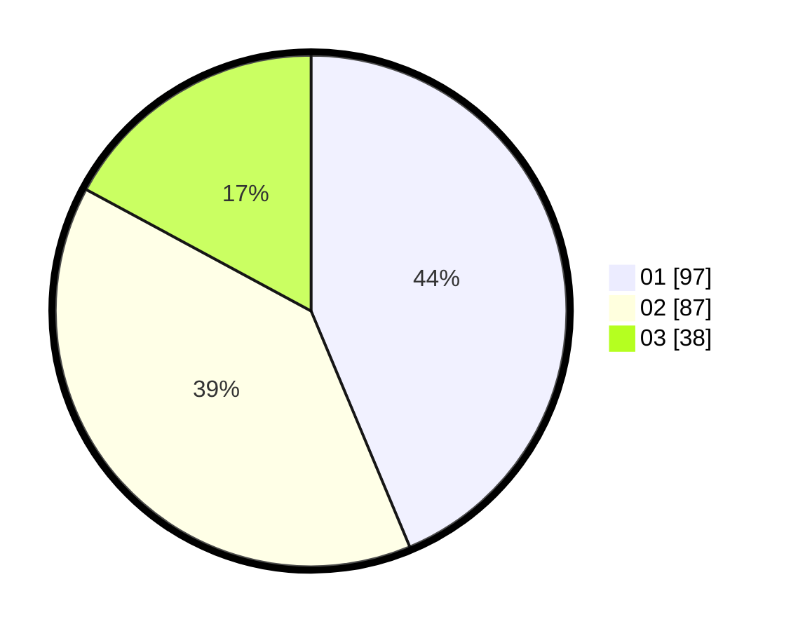

# Hasil

Hasil perolehan suara paslon dapat dilihat pada file paslon-01.txt, paslon-02.txt, dan paslon-03.txt.

Jika tidak ada, artinya data tersebut belum ada pada SIREKAP.

## Perolehan Suara

 * Paslon 01: **97**.
 * Paslon 02: **87**.
 * Paslon 03: **38**.

## Foto C Plano

https://sirekap-obj-formc.kpu.go.id/021c/pemilu/ppwp/31/74/03/10/02/3174031002070-20240215-191317--7508e331-8786-44a0-870d-b89063ba224b.jpg

https://sirekap-obj-formc.kpu.go.id/021c/pemilu/ppwp/31/74/03/10/02/3174031002070-20240215-191342--7185fe86-4ab0-4e21-8c88-9a2351759311.jpg

https://sirekap-obj-formc.kpu.go.id/021c/pemilu/ppwp/31/74/03/10/02/3174031002070-20240215-191331--0ca222e0-fa70-4bd1-9e5a-60d0ce6132b4.jpg

## DATA PEMILIH TETAP

Jumlah pemilih dalam DPT: **256**.
 * L: **122**.
 * P: **134**.

## DATA PENGGUNA HAK PILIH

Jumlah pengguna hak pilih dalam DPT: **209**.
 * L: **99**.
 * P: **110**.

Jumlah pengguna hak pilih dalam DPTb: **13**.
 * L: **5**.
 * P: **8**.

Jumlah pengguna hak pilih dalam DPK: **2**.
 * L: **0**.
 * P: **2**.

Jumlah pengguna hak pilih: **224**.
 * L: **104**.
 * P: **120**.

## JUMLAH SUARA SAH DAN TIDAK SAH

JUMLAH SELURUH SUARA SAH: **222**.

JUMLAH SUARA TIDAK SAH: **2**.

JUMLAH SELURUH SUARA SAH DAN SUARA TIDAK SAH: **224**.
