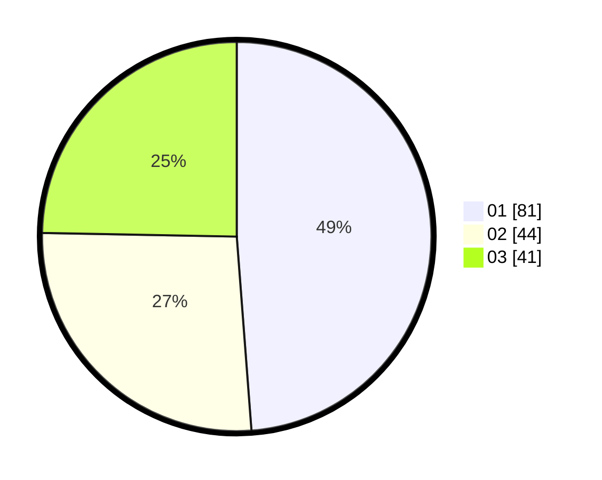

# Hasil

Hasil perolehan suara paslon dapat dilihat pada file paslon-01.txt, paslon-02.txt, dan paslon-03.txt.

Jika tidak ada, artinya data tersebut belum ada pada SIREKAP.

## Perolehan Suara

 * Paslon 01: **81**.
 * Paslon 02: **44**.
 * Paslon 03: **41**.

## Foto C Plano

https://sirekap-obj-formc.kpu.go.id/1678/pemilu/ppwp/31/74/03/10/02/3174031002072-20240215-173607--5b335628-5bf4-4bce-b377-2d4c7ac8e191.jpg

https://sirekap-obj-formc.kpu.go.id/1678/pemilu/ppwp/31/74/03/10/02/3174031002072-20240215-173636--0a621d3e-9ae2-4e8e-8d3d-456e68167cbc.jpg

https://sirekap-obj-formc.kpu.go.id/1678/pemilu/ppwp/31/74/03/10/02/3174031002072-20240215-173625--06b6f9de-9a52-426b-9906-d799b1c142b6.jpg

## DATA PEMILIH TETAP

Jumlah pemilih dalam DPT: **0**.
 * L: **0**.
 * P: **0**.

## DATA PENGGUNA HAK PILIH

Jumlah pengguna hak pilih dalam DPT: **163**.
 * L: **85**.
 * P: **78**.

Jumlah pengguna hak pilih dalam DPTb: **5**.
 * L: **1**.
 * P: **4**.

Jumlah pengguna hak pilih dalam DPK: **2**.
 * L: **0**.
 * P: **2**.

Jumlah pengguna hak pilih: **170**.
 * L: **86**.
 * P: **84**.

## JUMLAH SUARA SAH DAN TIDAK SAH

JUMLAH SELURUH SUARA SAH: **166**.

JUMLAH SUARA TIDAK SAH: **4**.

JUMLAH SELURUH SUARA SAH DAN SUARA TIDAK SAH: **170**.
