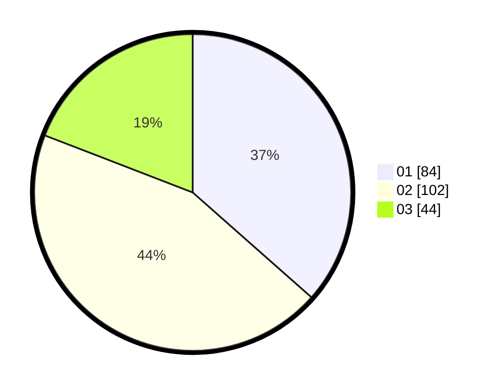

# Hasil

Hasil perolehan suara paslon dapat dilihat pada file paslon-01.txt, paslon-02.txt, dan paslon-03.txt.

Jika tidak ada, artinya data tersebut belum ada pada SIREKAP.

## Perolehan Suara

 * Paslon 01: **84**.
 * Paslon 02: **102**.
 * Paslon 03: **44**.

## Foto C Plano

https://sirekap-obj-formc.kpu.go.id/a5a4/pemilu/ppwp/31/74/03/10/03/3174031003001-20240216-224300--e8d74a6c-ae8b-4678-8d0a-b9942d729dd8.jpg

https://sirekap-obj-formc.kpu.go.id/a5a4/pemilu/ppwp/31/74/03/10/03/3174031003001-20240216-224326--12f37987-c37f-46d1-bccc-7ebff5c472ec.jpg

https://sirekap-obj-formc.kpu.go.id/a5a4/pemilu/ppwp/31/74/03/10/03/3174031003001-20240216-224351--a8d32807-708d-4fe5-84e2-48253bd4a400.jpg

## DATA PEMILIH TETAP

Jumlah pemilih dalam DPT: **287**.
 * L: **141**.
 * P: **146**.

## DATA PENGGUNA HAK PILIH

Jumlah pengguna hak pilih dalam DPT: **222**.
 * L: **103**.
 * P: **119**.

Jumlah pengguna hak pilih dalam DPTb: **11**.
 * L: **5**.
 * P: **6**.

Jumlah pengguna hak pilih dalam DPK: **1**.
 * L: **0**.
 * P: **1**.

Jumlah pengguna hak pilih: **234**.
 * L: **108**.
 * P: **126**.

## JUMLAH SUARA SAH DAN TIDAK SAH

JUMLAH SELURUH SUARA SAH: **230**.

JUMLAH SUARA TIDAK SAH: **4**.

JUMLAH SELURUH SUARA SAH DAN SUARA TIDAK SAH: **234**.
