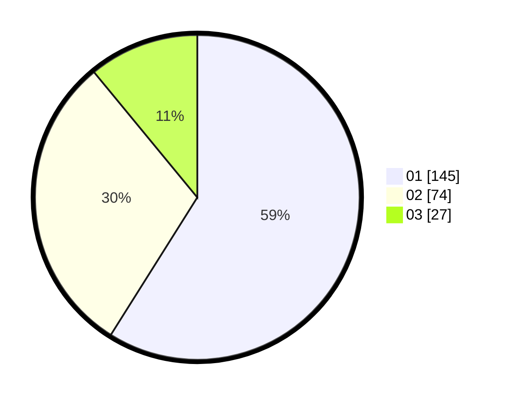

# Hasil

Hasil perolehan suara paslon dapat dilihat pada file paslon-01.txt, paslon-02.txt, dan paslon-03.txt.

Jika tidak ada, artinya data tersebut belum ada pada SIREKAP.

## Perolehan Suara

 * Paslon 01: **145**.
 * Paslon 02: **74**.
 * Paslon 03: **27**.

## Foto C Plano

https://sirekap-obj-formc.kpu.go.id/a11b/pemilu/ppwp/31/74/03/10/03/3174031003013-20240217-143705--0d3ae40d-aa18-4e16-b926-e3033685c78e.jpg

https://sirekap-obj-formc.kpu.go.id/a11b/pemilu/ppwp/31/74/03/10/03/3174031003013-20240217-144745--8a4f14df-cee0-4ba1-922d-a7b62eff76cf.jpg

https://sirekap-obj-formc.kpu.go.id/a11b/pemilu/ppwp/31/74/03/10/03/3174031003013-20240217-145039--f9dbbfd1-ae62-409b-9cf7-ee8c970d593f.jpg

## DATA PEMILIH TETAP

Jumlah pemilih dalam DPT: **285**.
 * L: **143**.
 * P: **142**.

## DATA PENGGUNA HAK PILIH

Jumlah pengguna hak pilih dalam DPT: **234**.
 * L: **118**.
 * P: **116**.

Jumlah pengguna hak pilih dalam DPTb: **8**.
 * L: **0**.
 * P: **8**.

Jumlah pengguna hak pilih dalam DPK: **6**.
 * L: **3**.
 * P: **3**.

Jumlah pengguna hak pilih: **248**.
 * L: **121**.
 * P: **127**.

## JUMLAH SUARA SAH DAN TIDAK SAH

JUMLAH SELURUH SUARA SAH: **246**.

JUMLAH SUARA TIDAK SAH: **2**.

JUMLAH SELURUH SUARA SAH DAN SUARA TIDAK SAH: **248**.
