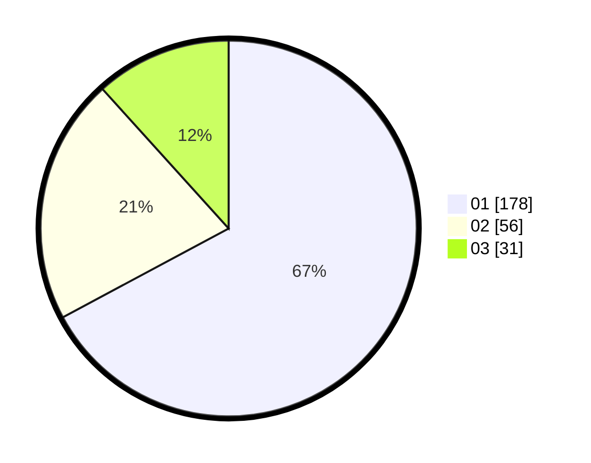

# Hasil

Hasil perolehan suara paslon dapat dilihat pada file paslon-01.txt, paslon-02.txt, dan paslon-03.txt.

Jika tidak ada, artinya data tersebut belum ada pada SIREKAP.

## Perolehan Suara

 * Paslon 01: **178**.
 * Paslon 02: **56**.
 * Paslon 03: **31**.

## Foto C Plano

https://sirekap-obj-formc.kpu.go.id/37ea/pemilu/ppwp/31/74/03/10/03/3174031003028-20240215-204800--71807b92-e5a3-4d30-8196-a39b7dfbfb33.jpg

https://sirekap-obj-formc.kpu.go.id/37ea/pemilu/ppwp/31/74/03/10/03/3174031003028-20240215-204801--a1f582b7-6289-4f5b-be89-3d91dc1d9122.jpg

https://sirekap-obj-formc.kpu.go.id/37ea/pemilu/ppwp/31/74/03/10/03/3174031003028-20240215-204800--21843876-ed77-48e0-bc93-c1df58539947.jpg

## DATA PEMILIH TETAP

Jumlah pemilih dalam DPT: **295**.
 * L: **138**.
 * P: **157**.

## DATA PENGGUNA HAK PILIH

Jumlah pengguna hak pilih dalam DPT: **248**.
 * L: **113**.
 * P: **135**.

Jumlah pengguna hak pilih dalam DPTb: **15**.
 * L: **8**.
 * P: **7**.

Jumlah pengguna hak pilih dalam DPK: **4**.
 * L: **2**.
 * P: **2**.

Jumlah pengguna hak pilih: **267**.
 * L: **123**.
 * P: **144**.

## JUMLAH SUARA SAH DAN TIDAK SAH

JUMLAH SELURUH SUARA SAH: **265**.

JUMLAH SUARA TIDAK SAH: **2**.

JUMLAH SELURUH SUARA SAH DAN SUARA TIDAK SAH: **267**.
