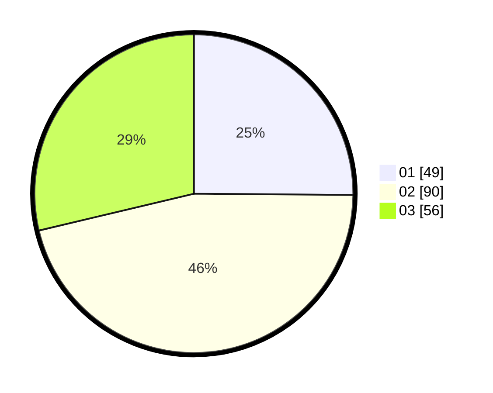

# Hasil

Hasil perolehan suara paslon dapat dilihat pada file paslon-01.txt, paslon-02.txt, dan paslon-03.txt.

Jika tidak ada, artinya data tersebut belum ada pada SIREKAP.

## Perolehan Suara

 * Paslon 01: **49**.
 * Paslon 02: **90**.
 * Paslon 03: **56**.

## Foto C Plano

https://sirekap-obj-formc.kpu.go.id/82e7/pemilu/ppwp/31/74/03/10/03/3174031003049-20240214-192425--a4db7f9e-abe1-45ac-9c4b-244e1479bfaf.jpg

https://sirekap-obj-formc.kpu.go.id/82e7/pemilu/ppwp/31/74/03/10/03/3174031003049-20240214-193931--d3d38ada-b011-4a06-acbb-49dd625a236c.jpg

https://sirekap-obj-formc.kpu.go.id/82e7/pemilu/ppwp/31/74/03/10/03/3174031003049-20240214-192503--4101ead5-873b-4567-9ab9-735b644a9bb1.jpg

## DATA PEMILIH TETAP

Jumlah pemilih dalam DPT: **257**.
 * L: **135**.
 * P: **122**.

## DATA PENGGUNA HAK PILIH

Jumlah pengguna hak pilih dalam DPT: **191**.
 * L: **97**.
 * P: **94**.

Jumlah pengguna hak pilih dalam DPTb: **4**.
 * L: **2**.
 * P: **2**.

Jumlah pengguna hak pilih dalam DPK: **2**.
 * L: **1**.
 * P: **1**.

Jumlah pengguna hak pilih: **197**.
 * L: **100**.
 * P: **97**.

## JUMLAH SUARA SAH DAN TIDAK SAH

JUMLAH SELURUH SUARA SAH: **195**.

JUMLAH SUARA TIDAK SAH: **2**.

JUMLAH SELURUH SUARA SAH DAN SUARA TIDAK SAH: **197**.
