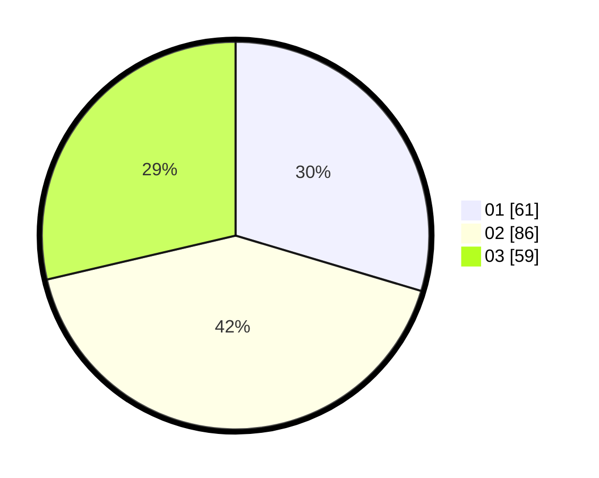

# Hasil

Hasil perolehan suara paslon dapat dilihat pada file paslon-01.txt, paslon-02.txt, dan paslon-03.txt.

Jika tidak ada, artinya data tersebut belum ada pada SIREKAP.

## Perolehan Suara

 * Paslon 01: **61**.
 * Paslon 02: **86**.
 * Paslon 03: **59**.

## Foto C Plano

https://sirekap-obj-formc.kpu.go.id/635b/pemilu/ppwp/31/74/03/10/03/3174031003050-20240214-155409--cd40741f-5075-4ad8-9526-4fa692ea178d.jpg

https://sirekap-obj-formc.kpu.go.id/635b/pemilu/ppwp/31/74/03/10/03/3174031003050-20240214-191129--d8cc82d9-3ebb-4a87-a416-52e5d56c8ff0.jpg

https://sirekap-obj-formc.kpu.go.id/635b/pemilu/ppwp/31/74/03/10/03/3174031003050-20240214-192555--0ce43281-4ede-433e-be76-2f8ac598f460.jpg

## DATA PEMILIH TETAP

Jumlah pemilih dalam DPT: **265**.
 * L: **129**.
 * P: **136**.

## DATA PENGGUNA HAK PILIH

Jumlah pengguna hak pilih dalam DPT: **203**.
 * L: **98**.
 * P: **105**.

Jumlah pengguna hak pilih dalam DPTb: **4**.
 * L: **1**.
 * P: **3**.

Jumlah pengguna hak pilih dalam DPK: **2**.
 * L: **0**.
 * P: **2**.

Jumlah pengguna hak pilih: **209**.
 * L: **99**.
 * P: **110**.

## JUMLAH SUARA SAH DAN TIDAK SAH

JUMLAH SELURUH SUARA SAH: **206**.

JUMLAH SUARA TIDAK SAH: **3**.

JUMLAH SELURUH SUARA SAH DAN SUARA TIDAK SAH: **209**.
