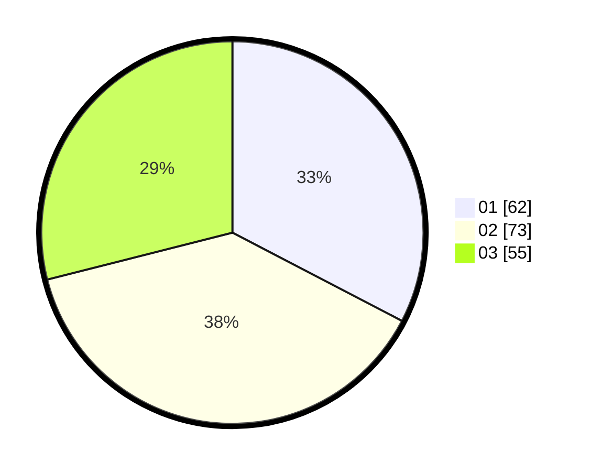

# Hasil

Hasil perolehan suara paslon dapat dilihat pada file paslon-01.txt, paslon-02.txt, dan paslon-03.txt.

Jika tidak ada, artinya data tersebut belum ada pada SIREKAP.

## Perolehan Suara

 * Paslon 01: **62**.
 * Paslon 02: **73**.
 * Paslon 03: **55**.

## Foto C Plano

https://sirekap-obj-formc.kpu.go.id/309f/pemilu/ppwp/31/74/03/10/03/3174031003057-20240214-155551--325ce484-cde8-40b2-b340-520e609b2011.jpg

https://sirekap-obj-formc.kpu.go.id/309f/pemilu/ppwp/31/74/03/10/03/3174031003057-20240214-155613--daa0878e-c40a-4f90-aa5f-a329ccd1794e.jpg

https://sirekap-obj-formc.kpu.go.id/309f/pemilu/ppwp/31/74/03/10/03/3174031003057-20240214-155629--a8e96893-bb54-4ed1-b196-54a94041e280.jpg

## DATA PEMILIH TETAP

Jumlah pemilih dalam DPT: **222**.
 * L: **107**.
 * P: **115**.

## DATA PENGGUNA HAK PILIH

Jumlah pengguna hak pilih dalam DPT: **185**.
 * L: **85**.
 * P: **100**.

Jumlah pengguna hak pilih dalam DPTb: **3**.
 * L: **1**.
 * P: **2**.

Jumlah pengguna hak pilih dalam DPK: **2**.
 * L: **0**.
 * P: **2**.

Jumlah pengguna hak pilih: **190**.
 * L: **86**.
 * P: **104**.

## JUMLAH SUARA SAH DAN TIDAK SAH

JUMLAH SELURUH SUARA SAH: **190**.

JUMLAH SUARA TIDAK SAH: **0**.

JUMLAH SELURUH SUARA SAH DAN SUARA TIDAK SAH: **190**.
