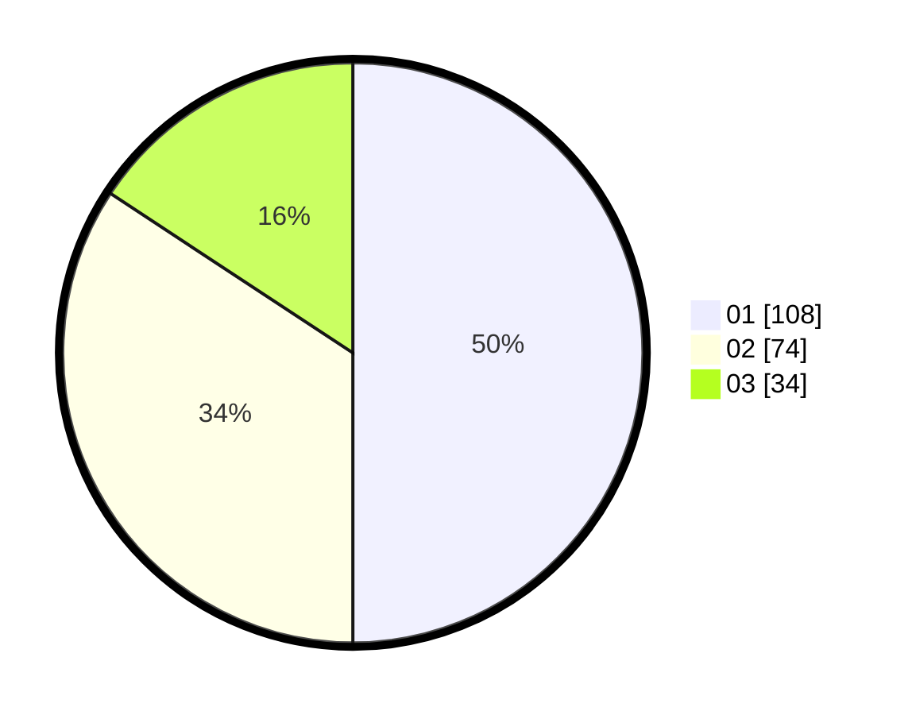

# Hasil

Hasil perolehan suara paslon dapat dilihat pada file paslon-01.txt, paslon-02.txt, dan paslon-03.txt.

Jika tidak ada, artinya data tersebut belum ada pada SIREKAP.

## Perolehan Suara

 * Paslon 01: **108**.
 * Paslon 02: **74**.
 * Paslon 03: **34**.

## Foto C Plano

https://sirekap-obj-formc.kpu.go.id/3382/pemilu/ppwp/31/74/03/10/03/3174031003064-20240216-131851--0fc98608-c051-4fdd-ae97-993de4b67e5c.jpg

https://sirekap-obj-formc.kpu.go.id/3382/pemilu/ppwp/31/74/03/10/03/3174031003064-20240216-131852--5664a818-547d-4e1e-9a2d-93fe001f3bc1.jpg

https://sirekap-obj-formc.kpu.go.id/3382/pemilu/ppwp/31/74/03/10/03/3174031003064-20240216-131851--fafcf35e-572a-4dd6-949b-9885411f2e0c.jpg

## DATA PEMILIH TETAP

Jumlah pemilih dalam DPT: **0**.
 * L: **0**.
 * P: **0**.

## DATA PENGGUNA HAK PILIH

Jumlah pengguna hak pilih dalam DPT: **0**.
 * L: **0**.
 * P: **0**.

Jumlah pengguna hak pilih dalam DPTb: **0**.
 * L: **0**.
 * P: **0**.

Jumlah pengguna hak pilih dalam DPK: **0**.
 * L: **0**.
 * P: **0**.

Jumlah pengguna hak pilih: **0**.
 * L: **0**.
 * P: **0**.

## JUMLAH SUARA SAH DAN TIDAK SAH

JUMLAH SELURUH SUARA SAH: **216**.

JUMLAH SUARA TIDAK SAH: **3**.

JUMLAH SELURUH SUARA SAH DAN SUARA TIDAK SAH: **219**.
