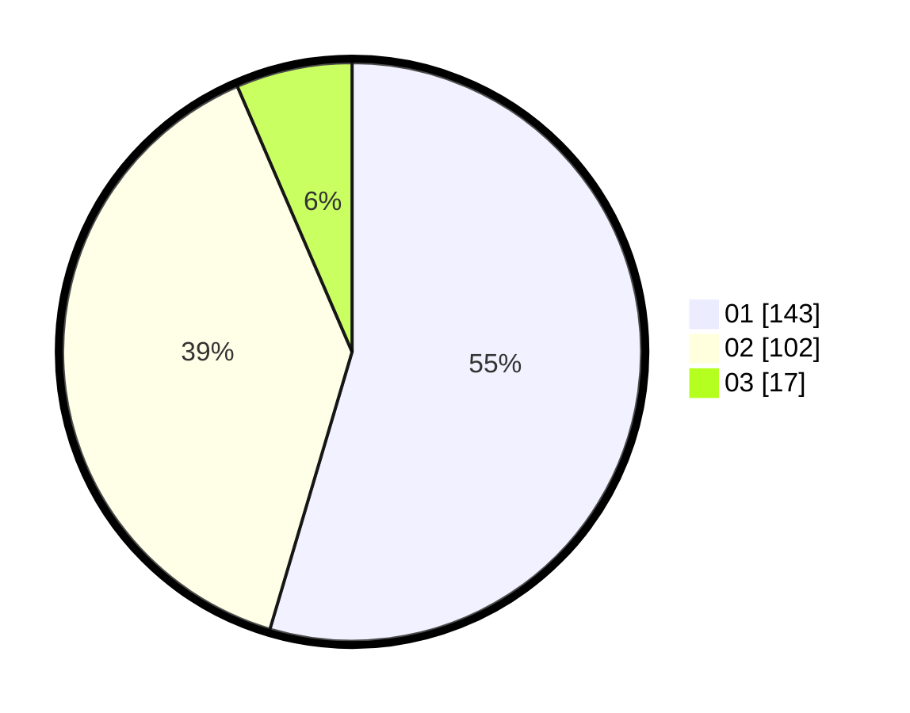

# Hasil

Hasil perolehan suara paslon dapat dilihat pada file paslon-01.txt, paslon-02.txt, dan paslon-03.txt.

Jika tidak ada, artinya data tersebut belum ada pada SIREKAP.

## Perolehan Suara

 * Paslon 01: **143**.
 * Paslon 02: **102**.
 * Paslon 03: **17**.

## Foto C Plano

https://sirekap-obj-formc.kpu.go.id/fd98/pemilu/ppwp/31/74/03/10/03/3174031003075-20240215-044453--87c824a7-ace7-4f46-ac01-0342f833f56e.jpg

https://sirekap-obj-formc.kpu.go.id/fd98/pemilu/ppwp/31/74/03/10/03/3174031003075-20240216-133943--0c747aa4-83ad-41bd-8bde-f809b18b972e.jpg

https://sirekap-obj-formc.kpu.go.id/fd98/pemilu/ppwp/31/74/03/10/03/3174031003075-20240215-162439--d0950ca3-d097-460d-bc37-48d74bc7b8bf.jpg
